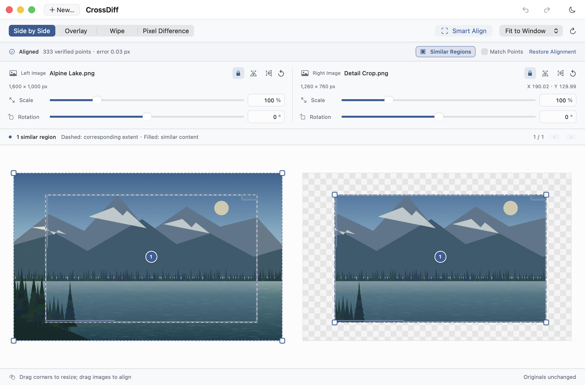
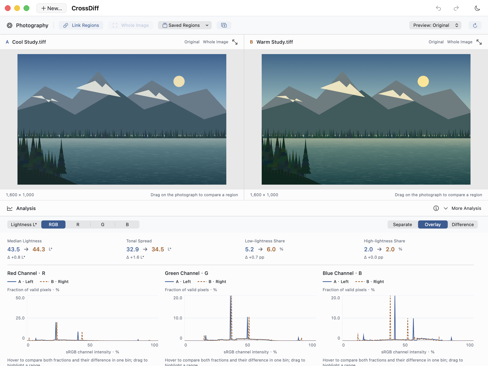
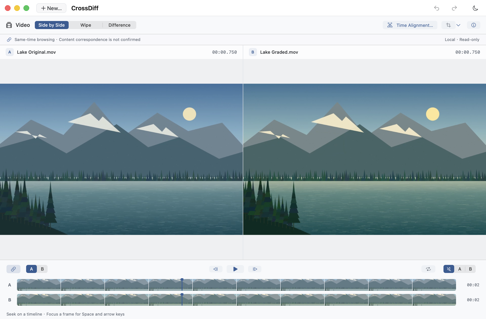
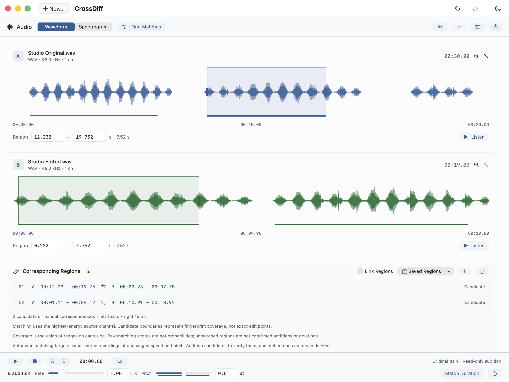
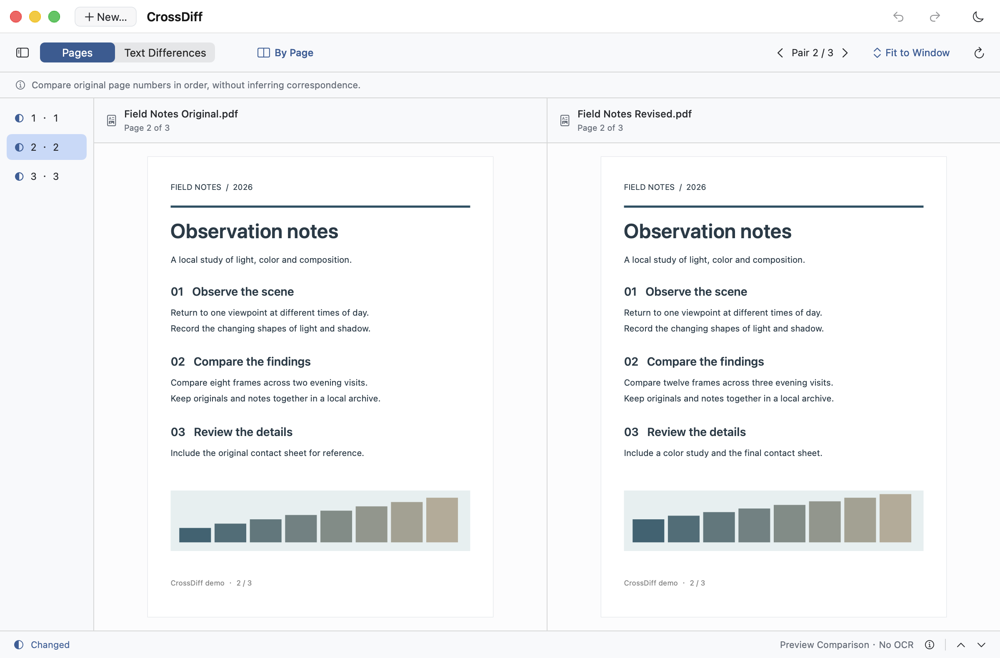
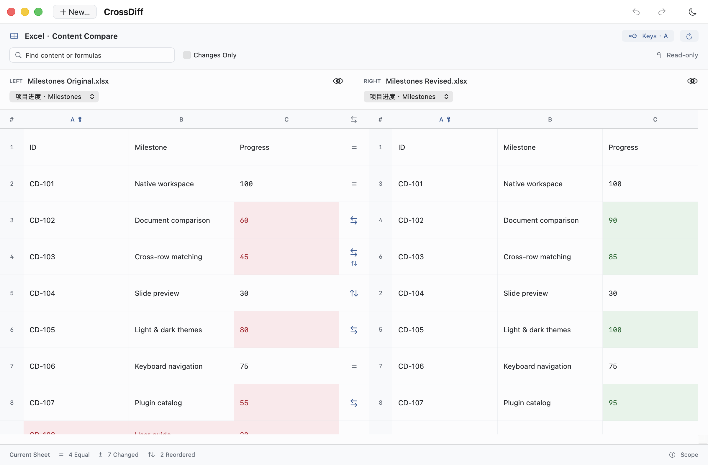
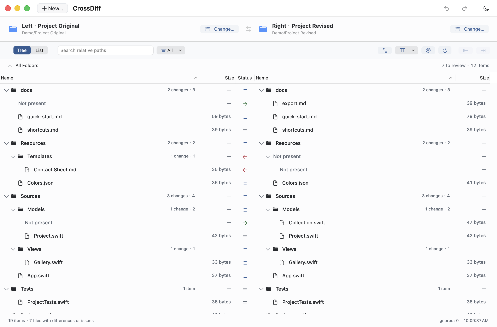
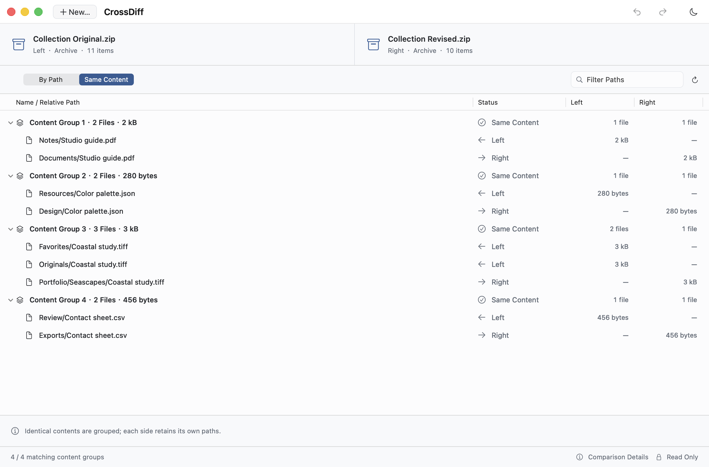
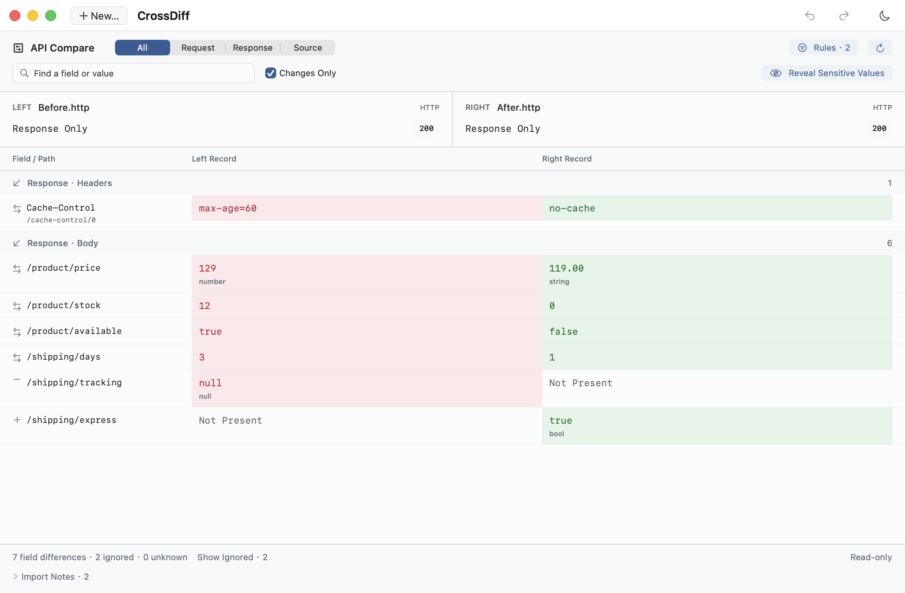
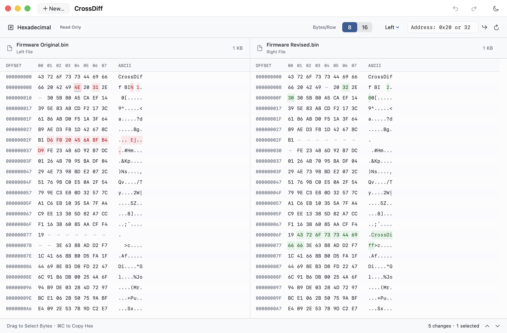

<div align="center">


<h1>CrossDiff</h1>

**Compare everything. See every change.**

A free, open-source comparison workspace built for the Mac.<br>
From text and code to documents, photographs, sound and video. Native. Local. No sign-up.

[简体中文](README.md) · [English](README.en.md)

[](#quick-start)
[](Package.swift)
[](LICENSE)

[Quick start](#quick-start) · [Download Full](https://github.com/JunyangZhangUSTC/CrossDiff/releases/download/v0.15.1/CrossDiff-0.15.1-full-macOS-arm64.zip) · [Features](#one-workspace-every-change-in-focus) · [Screenshots](#different-inputs-one-workspace) · [Editions](#choose-your-edition) · [Plugins](#extend-your-comparison-workspace) · [Privacy](#your-work-stays-on-your-mac)

</div>

> 🌟 **Not sure which edition to choose? Download Full: [CrossDiff-0.15.1-full-macOS-arm64.zip](https://github.com/JunyangZhangUSTC/CrossDiff/releases/download/v0.15.1/CrossDiff-0.15.1-full-macOS-arm64.zip).**
>
> For Apple silicon Macs running macOS 14+. Every official plugin for this version is preinstalled and ready to use.

<table>
<tr><td>
<a href="docs/assets/screenshots/text-en-light.png">
<picture>
  <source media="(prefers-color-scheme: dark)" srcset="docs/assets/screenshots/text-en-dark.png">
  
</picture>
</a>
</td></tr>
</table>

<p align="center"><sub>Text and code: see everything from a single character to a changed passage, then choose what to merge.</sub></p>

## One workspace, every change in focus

Paste two passages, inspect a release, study a photograph, or check an edit frame by frame. CrossDiff gives each kind of content a view that helps you find the changes that matter.

| | |
| :--- | :--- |
| **Built for the Mac**<br>SwiftUI + AppKit, a native editor, standard menus and familiar shortcuts. No bundled browser runtime. | **Your files stay local**<br>No uploads, telemetry or tracking. Once plugins are installed, keep comparing offline. |
| **Free. Open source. No sign-up.**<br>No accounts, subscriptions or feature paywalls. AGPL v3 source you can inspect, build and modify. | **Your originals, under your control**<br>Merge text blocks, undo independently and save explicitly. Image and media adjustments affect viewing, never the source. |
| **Clear and considered**<br>Light and dark themes, English and Simplified Chinese, tabs and synchronized scrolling. Familiar native controls across views. | **Room to grow with plugins**<br>Full includes eight official plugins. Or start with Base, then download plugins in the app or drag in a package. |

**0.15.1 stable release**: Git Compare joins Base, covering commits, branches, the staging area and working tree. Browse crowded tab bars more easily, open professional photography charts by default, and analyze saturated colors without histogram errors. [What’s new](docs/releases/0.15.1.md)

## Different inputs. One workspace.

Real app windows using programmatically generated demo images, audio, video and example files, shown in your GitHub light or dark theme. Click a screenshot to open the full-size light version and inspect the details.

### Images and media

<table>
<tr>
<td width="50%" valign="top">
<p><b>Images · Find the shared view</b></p>
<a href="docs/assets/screenshots/image-en-light.png">
<picture>
  <source media="(prefers-color-scheme: dark)" srcset="docs/assets/screenshots/image-en-dark.png">
  
</picture>
</a>
<p>Align cropped, rotated or scaled versions offline, then inspect similar regions, wipe views and pixel differences.</p>
<p><a href="docs/usage.md#compare-images">Usage guide →</a></p>
</td>
<td width="50%" valign="top">
<p><b>Photography · Understand tone and color</b></p>
<a href="docs/assets/screenshots/photography-en-light.png">
<picture>
  <source media="(prefers-color-scheme: dark)" srcset="docs/assets/screenshots/photography-en-dark.png">
  
</picture>
</a>
<p>Professional charts open by default: compare RGB/Lab L* histograms, HSL distributions and independent regions, with RAW support through macOS decoding.</p>
<p><a href="docs/usage.md#photography">Usage guide →</a></p>
</td>
</tr>
<tr>
<td width="50%" valign="top">
<p><b>Video · Review edits together</b></p>
<a href="docs/assets/screenshots/video-en-light.png">
<picture>
  <source media="(prefers-color-scheme: dark)" srcset="docs/assets/screenshots/video-en-dark.png">
  
</picture>
</a>
<p>Paired pictures and timelines with manual alignment, frame stepping and looped passages; pause for wipe or frame differences.</p>
<p><a href="docs/usage.md#video">Usage guide →</a></p>
</td>
<td width="50%" valign="top">
<p><b>Audio · See changes in sound</b></p>
<a href="docs/assets/screenshots/audio-en-light.png">
<picture>
  <source media="(prefers-color-scheme: dark)" srcset="docs/assets/screenshots/audio-en-dark.png">
  
</picture>
</a>
<p>Explore waveforms, STFT spectrograms and A/B audition, and find fixed-speed matching passages from the same recording.</p>
<p><a href="docs/usage.md#audio">Usage guide →</a></p>
</td>
</tr>
</table>

### Documents and Office

<table>
<tr>
<td width="50%" valign="top">
<p><b>PDF · Check the pages and the words</b></p>
<a href="docs/assets/screenshots/pdf-en-light.png">
<picture>
  <source media="(prefers-color-scheme: dark)" srcset="docs/assets/screenshots/pdf-en-dark.png">
  
</picture>
</a>
<p>Keep the original layout while reviewing extractable text differences, with page order, Smart Match or manual pairing.</p>
<p><a href="docs/usage.md#pdf-文档与插件--pdf-documents-and-plugins">Usage guide →</a></p>
</td>
<td width="50%" valign="top">
<p><b>Office · Match rows, even after reordering</b></p>
<a href="docs/assets/screenshots/office-en-light.png">
<picture>
  <source media="(prefers-color-scheme: dark)" srcset="docs/assets/screenshots/office-en-dark.png">
  
</picture>
</a>
<p>Compare Word paragraphs, Excel rows across positions or by key columns, and PowerPoint content, alongside original previews.</p>
<p><a href="docs/usage.md#office">Usage guide →</a></p>
</td>
</tr>
</table>

### Files and development

**Git · From commit history to your latest edits.** Open a local repository or a remote clone URL, then compare branches, tags or commits—or choose All Uncommitted, Staged or Unstaged. Select a file in the tree to see paired details, all read-only and without switching branches. [Usage guide →](docs/usage.md#git)

<table>
<tr>
<td width="50%" valign="top">
<p><b>Folders · Keep both sides aligned</b></p>
<a href="docs/assets/screenshots/folder-en-light.png">
<picture>
  <source media="(prefers-color-scheme: dark)" srcset="docs/assets/screenshots/folder-en-dark.png">
  
</picture>
</a>
<p>Linked trees, sorting and filters make large folders easier to browse; preview selected copies and revalidate files before writing.</p>
<p><a href="docs/usage.md#compare-folders">Usage guide →</a></p>
</td>
<td width="50%" valign="top">
<p><b>Archives · Look inside without extracting</b></p>
<a href="docs/assets/screenshots/archive-en-light.png">
<picture>
  <source media="(prefers-color-scheme: dark)" srcset="docs/assets/screenshots/archive-en-dark.png">
  
</picture>
</a>
<p>Compare archives with each other or local folders, inspect path differences, and find identical files across different locations.</p>
<p><a href="docs/usage.md#archives">Usage guide →</a></p>
</td>
</tr>
<tr>
<td width="50%" valign="top">
<p><b>API · Compare field by field</b></p>
<a href="docs/assets/screenshots/api-en-light.png">
<picture>
  <source media="(prefers-color-scheme: dark)" srcset="docs/assets/screenshots/api-en-dark.png">
  
</picture>
</a>
<p>Import HTTP, cURL or HAR locally to inspect headers, parameters and JSON values and types, with explicit ignore rules.</p>
<p><a href="docs/usage.md#api">Usage guide →</a></p>
</td>
<td width="50%" valign="top">
<p><b>Binary · Give every byte its place</b></p>
<a href="docs/assets/screenshots/binary-en-light.png">
<picture>
  <source media="(prefers-color-scheme: dark)" srcset="docs/assets/screenshots/binary-en-dark.png">
  
</picture>
</a>
<p>Paired hex and ASCII views preserve source addresses, align inserted or deleted bytes, and jump straight to a difference or offset.</p>
<p><a href="docs/usage.md#binary-hex">Usage guide →</a></p>
</td>
</tr>
</table>

<details>
<summary><b>Formats and capability boundaries</b></summary>

- **Text and code:** TXT, Markdown, HTML, JSON, XML, YAML and other text files, with find and replace, undo/redo and a read-only Show Deletions view.
- **Git repositories:** Local repositories, bare repositories and worktrees, or explicitly fetched HTTPS/SSH remotes. Read-only history and local-change comparison requires system Git; file detail previews are limited to 2 MiB per side.
- **Archives and Office:** ZIP, TAR and common compressed TAR formats, plus unencrypted, single-volume 7z and a limited RAR subset. Office supports DOCX/XLSX/PPTX; convert legacy formats first.
- **Images and photography:** Smart Align needs enough shared detail in related images. RAW support depends on the camera, encoding and macOS version. Analysis does not infer capture settings; processing curves are shown only when recorded.
- **Audio and video:** Automatic audio tempo/pitch recognition and video edit correspondence are not yet supported. Video differences require equal pixel dimensions and explicit Rec.709 SDR tags; HDR remains available for visual browsing.
- **PDF and Hex:** PDF has no OCR yet. Hex accepts up to 8 GiB per side and explicitly marks approximate alignment in complex regions. See the [user guide](docs/usage.md) and [implementation limits](docs/development.md#current-implementation-limits).

</details>

## Choose your edition

**Download above: 0.15.1 · macOS 14+ · Apple silicon (arm64)**

See the [release notes](docs/releases/0.15.1.md) for capabilities and limits, and the [validation records](docs/validation/README.md) for local test coverage.

**Full is recommended: all core features and every official plugin for the version, ready to use.** All eight official plugins—Archive, Git, PDF, Photography, API, Audio, Office and Video—are included.

Choose Base if you only need text, folders, images, Git, Hex and archives. Both editions are free, open source, and account-free.

<details>
<summary><b>Base edition, individual plugins, and other downloads</b></summary>

Base and Full differ only in their preinstalled plugins. You can add more plugins later.

| Download | Included | GitHub Release asset |
| :--- | :--- | :--- |
| **Full (recommended)** | Base plus every official plugin for that version; see the version summary above. | `CrossDiff-<version>-full-macOS-arm64.zip` |
| **Base** | Text, folders, images, Hex, and the bundled Git and Archive plugins. Start small and add what you need. | `CrossDiff-<version>-base-macOS-arm64.zip` |
| **Individual plugins** | Install packages compatible with your host version. Bundled plugins update with the app. | `CrossDiff-Plugin-<name>-<plugin-version>.crossdiffplugin` |

**[Download from GitHub Releases →](https://github.com/JunyangZhangUSTC/CrossDiff/releases)**

Choose files under a release's **Assets**; matching source, build information, and `SHA256SUMS` are included. Plugins require a compatible host. JSON is a separate developer example, not a Full bundle component.

</details>

Intel builds have not yet been verified. You can also build from source using the instructions below.

## Extend your comparison workspace

Choose **New… → More Comparisons**, or **CrossDiff → Plugins…**.

- **Install in the app:** choose **Download & Install** on the **Discover** page. CrossDiff downloads the matching GitHub Release package, verifies it, and completes the installation.
- **Install a downloaded file:** get a `.crossdiffplugin` from Release Assets, then drag it into CrossDiff or select it in the plugin manager.
- **Manage installed plugins:** the plugin manager opens on Installed, with visible controls to enable, disable or **uninstall** locally installed plugins. Updated plugins can also roll back.
- **Organize bundled plugins:** **remove** preinstalled plugins from your workspace and **restore** them offline whenever needed. Removal persists and keeps your files and sessions. Bundled files remain in the app, so its size does not change.

Browse the official list offline. **File comparisons stay local; plugin downloads and remote Git retrieval connect only when you request them.** No CrossDiff account is required.

Base features such as Git and Archive also ship as plugins, keeping different domains in one native workspace. Build a new comparison with the [English plugin guide](docs/plugins/development.en.md), [中文规范](docs/plugins/development.md), and [JSON example](Plugins/Examples/JSON/compare.js).

## Quick start

Download [Full](https://github.com/JunyangZhangUSTC/CrossDiff/releases/download/v0.15.1/CrossDiff-0.15.1-full-macOS-arm64.zip), extract it, and open **CrossDiff.app**. No Swift toolchain is required.

1. Click **New…** (⌘N), then choose Text, Folders, Images, Git, Binary, Archives, or another installed plugin.
2. Prepare the left and right inputs and click **Compare**. For text, paste directly or select a file; for Git, open a repository and choose the two sources.
3. Review the differences. With text, edit either side, merge individual blocks, and save explicitly when ready.

**File → Open…** (⌘O) accepts multiple files or folders, with explicit pairs opening in separate tabs. Clear Both starts a fresh text comparison, with an immediate restore action. See the [user guide](docs/usage.md), or try the repository's [Swift examples](examples/).

### First launch on macOS

The current downloads do not yet have an Apple Developer ID signature or notarization. Builds use an ad-hoc signature. The developer program's annual cost means that, for now, you may need to approve your first launch manually.

After confirming that the download came from this repository's Release:

1. Extract the app and try opening **CrossDiff.app** once.
2. If macOS cannot verify the developer, go to **System Settings → Privacy & Security** and choose **Open Anyway** for CrossDiff.
3. Confirm **Open** and authenticate if prompted. Subsequent launches normally open directly.

This follows [Apple's official guidance](https://support.apple.com/en-us/102445); there is no need to disable Gatekeeper system-wide. Source and release checksums are public, so you can inspect, verify, or build the app yourself. See the [release guide](docs/releasing.md).

<details>
<summary><b>Common shortcuts</b></summary>

| Action | Shortcut |
| :--- | :--- |
| New comparison / open files or folders | ⌘N / ⌘O |
| Undo / redo | ⌘Z / ⇧⌘Z |
| Find / find and replace | ⌘F / ⌥⌘F |
| Next / previous match | ⌘G / ⇧⌘G |
| Next / previous difference | ⌥⌘↓ / ⌥⌘↑ |
| Save the focused side | ⌘S |
| Settings / language | ⌘, |

Choose **CrossDiff → 设置/Setting… → 语言/Language** to switch between English and 简体中文. The interface updates immediately, without restarting.

</details>

<details>
<summary><b>Build from source</b></summary>

Install a toolchain that supports **Swift 6.0 package manifests**, then run from the project root:

```sh
bash scripts/build-app.sh
bash scripts/open-dev-app.command
```

The first build downloads SHA-256-pinned OpenCV 4.12.0 source and compiles only `core`, `imgproc`, `features2d`, `calib3d` and `flann`. If CMake is missing, it is prepared inside the project too. Dependencies, tools, and caches stay under `.build/photo-deps/`; nothing is installed globally.

The project uses Swift 5 language mode and builds for your Mac's architecture. The app is created at `dist/CrossDiff.app`. The development launcher keeps sessions, preferences, and caches inside the checkout; it installs nothing globally or into `/Applications`. See the [release guide](docs/releasing.md) for edition packaging and publishing.

</details>

## Your work stays on your Mac

Built-in comparisons and restricted plugins process files on your computer, **without uploading comparison content**. No accounts, telemetry, analytics, or cloud sync. Once plugins are installed, you can keep comparing offline. Connections are only for plugin downloads or remote Git repository retrieval that you initiate; local repository comparisons work offline.

Restore temporary comparisons locally or clear them from the Session menu. Sessions store text and paths in plain text. Storage locations, third-party plugin permissions, and security reporting are documented in [SECURITY.md](SECURITY.md).

## Compare everything, one step at a time

Our direction is **“Compare everything. Make every comparison count.”** Start with everyday work, then connect more domains through extensible data sources, algorithms, and specialized views.

| Available today | Next to explore |
| :--- | :--- |
| Text, folders, images, Git, Hex, archives, PDF, Photography, API, Audio and Office; manual video comparison | Remote folder sources, three-way text merging, and multi-object comparison |
| A native workspace, plugin management, Base and Full editions | Legacy Office and full visual comparison, network packets, databases, advanced photography analysis, model structures, and tensor plugins; automatic audio tempo/pitch recognition and video segment correspondence |
| English and Simplified Chinese, light and dark themes, local session restoration | Plugin bundles for photographers, media professionals, and developers |

The right column is **planned work**. Current views provide two-way comparison. PDF has no OCR yet; archives do not support encryption, multiple volumes, or every 7z/RAR feature; folders do not provide full synchronization. See the [roadmap](docs/roadmap.md) and [implementation limits](docs/development.md#current-implementation-limits) for file limits, RAW compatibility, and analysis boundaries.

Share bugs and ideas in [Issues](https://github.com/JunyangZhangUSTC/CrossDiff/issues), and help make comparisons better. [Contributing](CONTRIBUTING.md) · [Development](docs/development.md) · [Product direction](docs/product-vision.md) · [Changelog](CHANGELOG.md)

## License

Copyright © 2026 **Junyang Zhang**. CrossDiff is licensed under the [GNU Affero General Public License v3.0](LICENSE) (`AGPL-3.0-only`). See [NOTICE](NOTICE) for the copyright notice.
