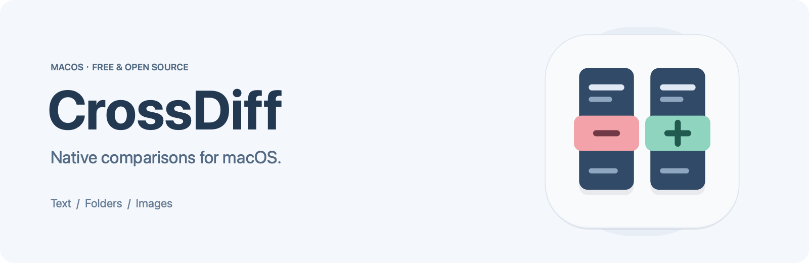
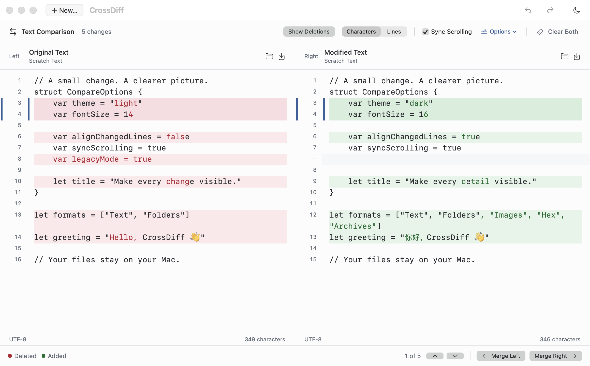
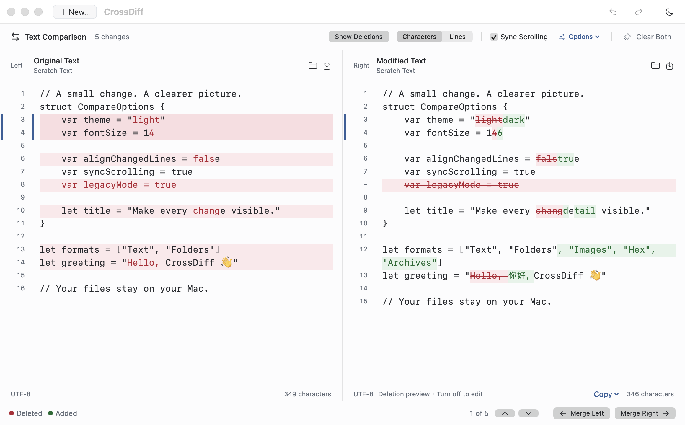
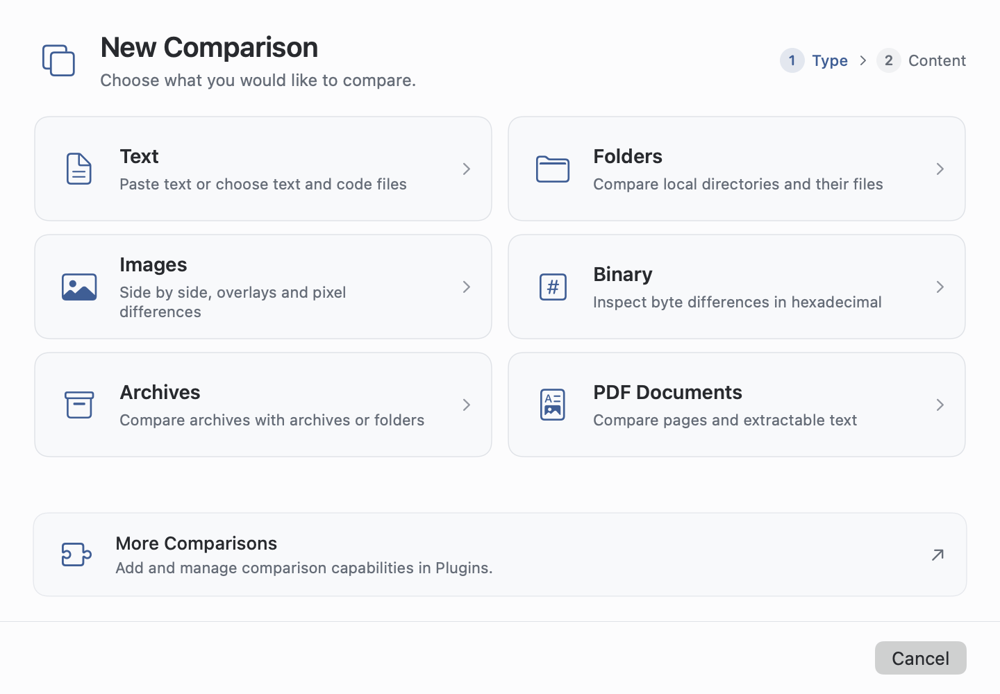

<div align="center">



**Compare everything. See every change.**

A free, open-source comparison workspace built for the Mac.<br>
Local processing. Native interaction. No sign-up. Ready when you are. Extend it with plugins.

[简体中文](README.md) · [English](README.en.md)

[](#get-started)
[](Package.swift)
[](LICENSE)
[](CHANGELOG.md)

[Download Base](https://github.com/JunyangZhangUSTC/CrossDiff/releases/download/v0.8.0/CrossDiff-0.8.0-base-macOS-arm64.zip) · [Features](#one-workspace-every-change-in-focus) · [Choose an edition](#choose-your-edition) · [Plugins](#extend-your-comparison-workspace) · [Privacy](#your-work-stays-on-your-mac) · [Roadmap](#compare-everything-one-step-at-a-time)

</div>

> 🌟 **Not sure which edition to choose? Download Base: [CrossDiff-0.8.0-base-macOS-arm64.zip](https://github.com/JunyangZhangUSTC/CrossDiff/releases/download/v0.8.0/CrossDiff-0.8.0-base-macOS-arm64.zip).**
>
> For Apple silicon Macs running macOS 14+. Start with Base for everyday comparisons; add the PDF plugin in the app when needed.

<table>
<tr><td>
<picture>
  <source media="(prefers-color-scheme: dark)" srcset="docs/assets/screenshots/text-en-dark.png">
  
</picture>
</td></tr>
</table>

<p align="center"><sub>A real app window with sample text. Screenshots follow your GitHub light or dark theme.</sub></p>

## One workspace, every change in focus

From a quick text paste to code directories, archives, images, and research PDFs. CrossDiff brings different comparisons into one native Mac workspace: clear differences, direct controls, and files that stay in your hands.

| | |
| :--- | :--- |
| **Built for the Mac**<br>SwiftUI + AppKit, a native editor, standard menus, and familiar keyboard shortcuts. No bundled browser runtime. | **Local and private**<br>Compare files on your Mac without uploading them. No telemetry or tracking. Keep working offline. |
| **Free and open source**<br>AGPL v3 source you can inspect, build, and modify. No subscriptions, trial clocks, or feature paywalls. | **No sign-up. Ready to use.**<br>No account, login, or activation. Open the app, choose the two inputs, and start comparing. |
| **Precise differences, deliberate edits**<br>Character highlights, aligned rows, block merging, independent undo, and explicit saving. Comparing never overwrites your source files. | **Considered design, room to grow**<br>Light and dark themes, English and Simplified Chinese, tabs, and synchronized scrolling. Add plugins when you need more. |

## Different inputs. A familiar workflow.

| Compare | Available today |
| :--- | :--- |
| **Text & code** | Paste text or open files; inspect character or line changes; align rows; edit either side; merge blocks; find and replace; undo independently. Works with text formats such as TXT, Markdown, HTML, JSON, XML, and YAML. |
| **Local folders** | Compare directories recursively, filter differences, find one-sided files, and preview additions or overwrites before copying selected files. |
| **Archives** | Treat ZIP, TAR, and common compressed TAR formats as virtual folders. Compare an archive with another archive or a local folder, verify contents, and find identical files across paths without extracting to disk. Bundled with Base. |
| **Images** | Side-by-side, overlay, wipe, and pixel-difference views. Scale, rotate, flip, drag to align, resize from corners, or compare only the overlapping area. |
| **Binary / Hex** | Native paired hex and ASCII, real source addresses, insertion/deletion alignment, change navigation, address jumps, and selected copy. Read-only, with on-demand reads. |
| **PDF documents** | Page matching, inserted/deleted-page navigation, native page previews, and extracted-text differences. Included in Full; available as an official plugin for Base. |

<details>
<summary><b>The details make a difference</b></summary>

- **See removals as well as additions.** Turn on Show Deletions to display removed text as red strikethroughs on the right. This read-only review never writes markup into your source. Standard copy includes original text only; revision copy is an explicit action.
- **Find a common view for your images.** Drag a corner to resize with the aspect ratio locked by default, or unlock it to stretch width and height independently. Size and rotation also accept numeric values. Changes affect the preview only. [Image alignment guide](docs/usage.md#compare-images)
- **Make byte changes readable.** Hex keeps independent source offsets, aligns insertion/deletion gaps, and supports 8 or 16 bytes per row. Inputs can be up to 8 GiB each; complex regions are explicitly marked as approximately aligned. [Hex guide](docs/usage.md#binary-hex)
- **Skip the extraction folder.** Compare ZIP, TAR, TAR.GZ/TGZ, TAR.BZ2, and TAR.XZ. By Path reveals directory changes; Same Content finds matching files across paths. Read-only streaming never extracts files to disk. [Archive guide](docs/usage.md#archives)

<table>
<tr><td>
<picture>
  <source media="(prefers-color-scheme: dark)" srcset="docs/assets/screenshots/deletions-en-dark.png">
  
</picture>
</td></tr>
</table>

</details>

## Choose your edition

**Current developer preview: 0.8.0 · macOS 14+ · Apple silicon (arm64)**

Base is the everyday starting point. Choose Full if you want PDF preinstalled. Both are free, open source, and account-free.

<details>
<summary><b>Full edition, individual plugins, and other downloads</b></summary>

Base and Full differ only in their preinstalled plugins. You can add more plugins later.

| Download | Included | GitHub Release asset |
| :--- | :--- | :--- |
| **Base** | Text, folders, images, Hex, and the bundled Archive plugin. Start small and add what you need. | `CrossDiff-<version>-base-macOS-arm64.zip` |
| **Full** | Everything in Base, plus every currently released official plugin. This release additionally includes PDF. | `CrossDiff-<version>-full-macOS-arm64.zip` |
| **Individual plugins** | Base can install or update PDF separately; an Archive package is also provided. Bundled plugins update with the app. | `CrossDiff-Plugin-PDF-<plugin-version>.crossdiffplugin`<br>`CrossDiff-Plugin-Archive-<plugin-version>.crossdiffplugin` |

**[Download from GitHub Releases →](https://github.com/JunyangZhangUSTC/CrossDiff/releases)**

Choose the files you need under a release's **Assets**. Each release also includes source, build information, and `SHA256SUMS`. The JSON plugin is distributed separately as a developer example and is not preinstalled in Full. Planned Office, photography, audio, and video capabilities are not part of the current Full edition.

</details>

Intel builds have not yet been verified. CrossDiff is an actively developed preview; you can also build it from source using the instructions below.

## Extend your comparison workspace

Choose **New… → More Comparisons**, or **CrossDiff → Plugins…**.

- **Install in the app:** choose **Download & Install** in the official plugin list. CrossDiff downloads the matching GitHub Release package, verifies it, and completes the installation.
- **Install a downloaded file:** get a `.crossdiffplugin` from Release Assets, then drag it into CrossDiff or select it in the plugin manager.
- **Stay in control:** disable, uninstall, or roll back updated plugins while keeping existing comparison sessions.

Browse the official list offline. **The app connects only when you choose to download a plugin; your comparisons stay local.** No registration or GitHub login is required.

Base features can also be plugins: Archive ships as an official plugin with Base. Extension interfaces pair different algorithms with native directory trees, document pages, and table views, keeping a consistent Mac experience. Build something new with the [English plugin guide](docs/plugins/development.en.md), [中文规范](docs/plugins/development.md), and [JSON example](Plugins/Examples/JSON/compare.js).

## Get started

Download [Base](https://github.com/JunyangZhangUSTC/CrossDiff/releases/download/v0.8.0/CrossDiff-0.8.0-base-macOS-arm64.zip), extract it, and open **CrossDiff.app**. No Swift toolchain is required.

1. Click **New…** (⌘N), then choose text, folders, archives, images, binary files, or an installed plugin.
2. Prepare the left and right inputs and click **Compare**. For text, paste directly or select a file.
3. Review the differences. With text, edit either side, merge individual blocks, and save explicitly when ready.

<table>
<tr><td>
<picture>
  <source media="(prefers-color-scheme: dark)" srcset="docs/assets/screenshots/new-en-dark.png">
  
</picture>
</td></tr>
</table>

**File → Open…** (⌘O) accepts multiple files or folders, with explicit pairs opening in separate tabs. Clear Both starts a fresh text comparison, with an immediate restore action. See the [user guide](docs/usage.md), or try the repository's [Swift examples](examples/).

### First launch on macOS

This preview does not yet have an Apple Developer ID signature or notarization. Builds use an ad-hoc signature. The developer program's annual cost means that, for now, you may need to approve your first launch manually.

After confirming that the download came from this repository's Release:

1. Extract the app and try opening **CrossDiff.app** once.
2. If macOS cannot verify the developer, go to **System Settings → Privacy & Security** and choose **Open Anyway** for CrossDiff.
3. Confirm **Open** and authenticate if prompted. Subsequent launches normally open directly.

This follows [Apple's official guidance](https://support.apple.com/en-us/102445); there is no need to disable Gatekeeper system-wide. Source and release checksums are public, so you can inspect, verify, or build the app yourself. See the [release guide](docs/releasing.md).

<details>
<summary><b>Common shortcuts</b></summary>

| Action | Shortcut |
| :--- | :--- |
| New comparison / open files or folders | ⌘N / ⌘O |
| Undo / redo | ⌘Z / ⇧⌘Z |
| Find / find and replace | ⌘F / ⌥⌘F |
| Next / previous match | ⌘G / ⇧⌘G |
| Next / previous difference | ⌥⌘↓ / ⌥⌘↑ |
| Save the focused side | ⌘S |
| Settings / language | ⌘, |

Choose **CrossDiff → 设置/Setting… → 语言/Language** to switch between English and 简体中文. The interface updates immediately, without restarting.

</details>

<details>
<summary><b>Build from source</b></summary>

Install a toolchain that supports **Swift 6.0 package manifests**, then run from the project root:

```sh
bash scripts/build-app.sh
bash scripts/open-dev-app.command
```

The project uses Swift 5 language mode and builds for your Mac's architecture. The app is created at `dist/CrossDiff.app`. The development launcher keeps sessions, preferences, and caches inside the checkout; it installs nothing globally or into `/Applications`. See the [release guide](docs/releasing.md) for edition packaging and publishing.

</details>

## Your work stays on your Mac

Built-in comparisons and restricted plugins process files on your computer, **without uploading comparison content**. No accounts, telemetry, analytics, or cloud sync. Once plugins are installed, you can keep comparing offline. Connections are for plugin downloads you initiate.

Restore temporary comparisons locally or clear them from the Session menu. Sessions store text and paths in plain text. Storage locations, third-party plugin permissions, and security reporting are documented in [SECURITY.md](SECURITY.md).

## Compare everything, one step at a time

Our direction is **“Compare everything. Make every comparison count.”** Start with everyday work, then connect more domains through extensible data sources, algorithms, and specialized views.

| Available today | Next to explore |
| :--- | :--- |
| Text, folders, images, Hex, archives, and the PDF plugin | Remote folder sources, three-way text merging, and multi-object comparison |
| A native workspace, plugin management, Base and Full editions | Office, APIs/logs/packets, databases, photography and RAW, audio, video, model structures, and tensor plugins |
| English and Simplified Chinese, light and dark themes, local session restoration | Plugin bundles for photographers, media professionals, and developers |

The right column is **planned work**, not implemented functionality or content already included in Full. Current views and plugins provide two-way comparisons. PDF does not yet include OCR; archives do not yet support RAR, 7z, or encryption; folder operations do not provide full synchronization. Image previews are limited to 1600 px on the longest edge, and text files to 20 MB. See the [roadmap](docs/roadmap.md) and [implementation limits](docs/development.md#current-implementation-limits).

Share bugs and ideas in [Issues](https://github.com/JunyangZhangUSTC/CrossDiff/issues), and help make comparisons better. [Contributing](CONTRIBUTING.md) · [Development](docs/development.md) · [Product direction](docs/product-vision.md) · [Changelog](CHANGELOG.md)

## License

Copyright © 2026 **Junyang Zhang**. CrossDiff is licensed under the [GNU Affero General Public License v3.0](LICENSE) (`AGPL-3.0-only`). See [NOTICE](NOTICE) for the copyright notice.
