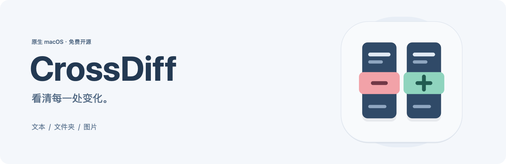
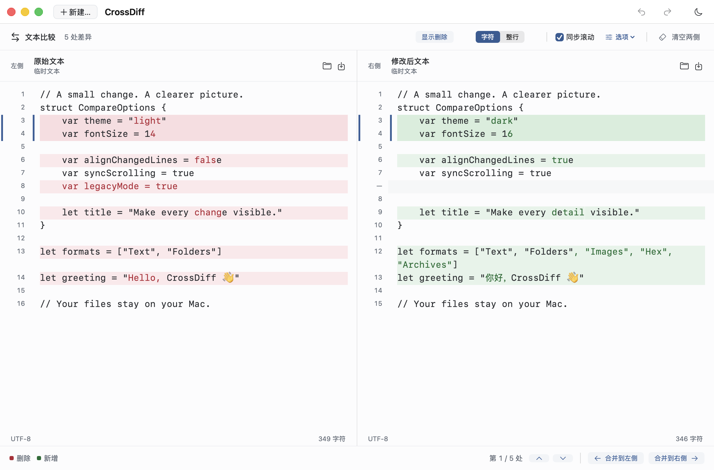
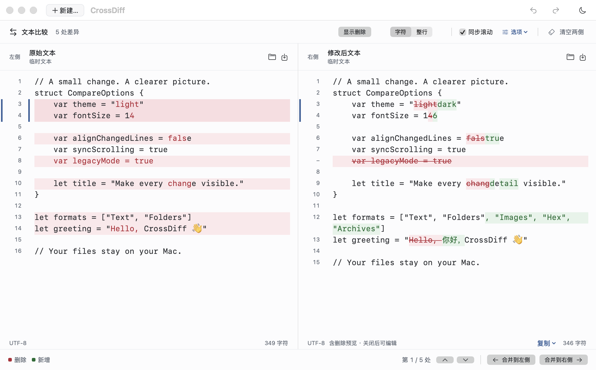
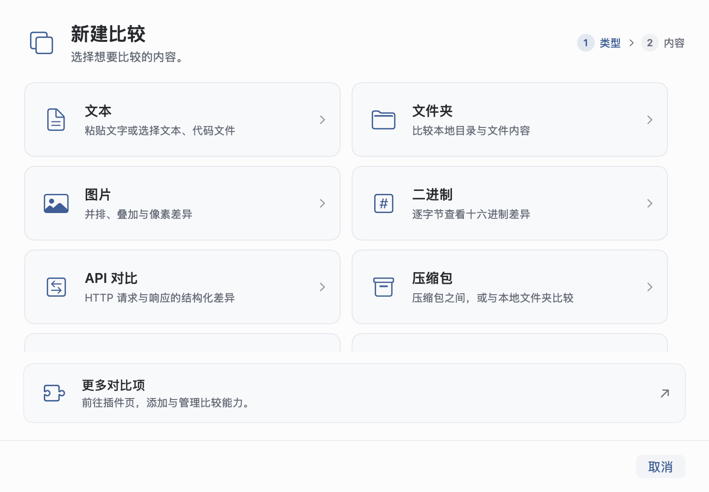

<div align="center">



**对比一切，把每一处变化看清。**

为 Mac 打造的免费开源比较工作台。<br>
本地处理，原生体验，无需注册，开箱即用。用插件，让比较的边界继续扩展。

[简体中文](README.md) · [English](README.en.md)

[](#快速开始)
[](Package.swift)
[](LICENSE)
[](CHANGELOG.md)

[下载基础版](https://github.com/JunyangZhangUSTC/CrossDiff/releases/download/v0.8.0/CrossDiff-0.8.0-base-macOS-arm64.zip) · [功能特色](#一个工作台专注每一处变化) · [选择版本](#选择适合你的版本) · [插件扩展](#用插件拓展你的比较工作台) · [隐私](#文件留在你的-mac-上) · [路线图](#对比一切持续向前)

</div>

> 🌟 **不想选版本？直接下载基础版：[CrossDiff-0.8.0-base-macOS-arm64.zip](https://github.com/JunyangZhangUSTC/CrossDiff/releases/download/v0.8.0/CrossDiff-0.8.0-base-macOS-arm64.zip)。**
>
> 适用于 macOS 14+ 的 Apple 芯片 Mac。日常比较从基础版开始，需要 PDF 时再在应用内安装插件。

<table>
<tr><td>
<picture>
  <source media="(prefers-color-scheme: dark)" srcset="docs/assets/screenshots/text-zh-CN-dark.png">
  
</picture>
</td></tr>
</table>

<p align="center"><sub>真实应用窗口，使用示例文本；截图随 GitHub 的浅深色主题切换。</sub></p>

## 一个工作台，专注每一处变化

从临时粘贴的两段文字，到代码目录、压缩包、图片和论文 PDF。CrossDiff 把不同对象的比较带到同一个原生 Mac 工作台：看得清楚，操作直接，文件始终由你掌握。

| | |
| :--- | :--- |
| **为 Mac 原生打造**<br>SwiftUI + AppKit，原生编辑器、标准菜单和熟悉的快捷键。无需内置浏览器运行环境。 | **本地运行，隐私优先**<br>文件比较在本机完成，无需上传。无遥测、无追踪，离线也能安心比较。 |
| **免费开源，没有付费墙**<br>AGPL v3 开源，源码可审查、构建和修改。无订阅、试用倒计时或付费解锁。 | **无需注册，开箱即用**<br>没有账号、登录或激活步骤。打开应用、选好左右内容，就能开始比较。 |
| **细致比较，修改可控**<br>字符级差异、行对齐、逐块合并、独立撤销与手动保存。只做比较，不会覆盖原文件。 | **优雅界面，按需扩展**<br>浅深色主题、中英文切换、多标签与同步滚动。安装插件，继续拓展比较能力。 |

## 多种对象，同样顺手

| 比较对象 | 当前能力 |
| :--- | :--- |
| **文本与代码** | 粘贴文本或打开文本文件，字符／整行差异、行对齐、左右编辑、逐块合并、查找替换与独立撤销。支持 TXT、Markdown、HTML、JSON、XML、YAML 等文本格式。 |
| **本地文件夹** | 递归比较目录，筛选差异、查找单侧文件；复制选中文件前预览新增与覆盖项。 |
| **压缩包** | 把 ZIP、TAR 及常见压缩 TAR 当作虚拟目录，与压缩包或本地文件夹互比。无需解压到磁盘，按内容校验，找出不同路径下的相同文件。基础版内置插件。 |
| **图片** | 并排、叠加、滑动与像素差异；独立缩放、旋转、翻转、拖动对齐与四角调整，支持只比较重叠区域。 |
| **二进制 / Hex** | 原生双栏十六进制与 ASCII，真实地址、插删对齐、差异导航、地址跳转和选中复制。按需读取，只读比较。 |
| **PDF 文档** | 页面匹配、插删页导航、原生页面对照与可提取文字差异。完整版预装，基础版可安装官方 PDF 插件。 |
| **摄影 · 0.9.0 源码预览** | 只读双图、RGB／HSL 直方图、局部框选与命名区域、拍摄信息、有记录的处理曲线；Apple 原生 RAW 解码与 OpenCV 专业统计。[摄影指南](docs/usage.md#photography) |

<details>
<summary><b>细节也值得认真对比</b></summary>

- **看见删除，而不只看见新增。** 开启“显示删除”，右侧以红色删除线呈现被移除的文字。只读审阅不会把修订标记写入原文；普通复制仅含原文，含修订内容需显式选择。
- **为图片找到共同视角。** 拖动四角调整大小，默认锁定比例；解锁后可独立拉伸宽高。大小与旋转也可输入数值，所有变换仅影响预览。[图片对齐指南](docs/usage.md#compare-images)
- **让字节变化可读。** Hex 两侧保留独立源偏移，插删空位对齐，支持 8／16 字节列宽。每个文件最多 8 GiB，复杂区域明确标注粗略对齐。[Hex 指南](docs/usage.md#binary-hex)
- **不用先解压一地文件。** 支持 ZIP、TAR、TAR.GZ／TGZ、TAR.BZ2、TAR.XZ；“按路径”看目录差异，“相同内容”找跨路径重复。全程只读，流式解码，不写出解压文件。[压缩包指南](docs/usage.md#archives)

<table>
<tr><td>
<picture>
  <source media="(prefers-color-scheme: dark)" srcset="docs/assets/screenshots/deletions-zh-CN-dark.png">
  
</picture>
</td></tr>
</table>

</details>

## 选择适合你的版本

**已发布下载：0.8.0 · 源码开发预览：0.9.0 · macOS 14+ · Apple 芯片（arm64）**

摄影插件已加入 0.9.0 源码预览，尚未发布到 GitHub Release。要体验摄影对比，请从本仓库构建；上方下载链接仍是已发布的 0.8.0。

基础版适合日常使用；想预装 PDF，就选完整版。两者均免费、开源，无需账号。

<details>
<summary><b>查看完整版、独立插件和其他下载文件</b></summary>

基础版与完整版的区别在于预装插件；之后也可以按需安装。

| 下载 | 包含内容 | GitHub Release 文件 |
| :--- | :--- | :--- |
| **基础版 Base** | 文本、文件夹、图片、Hex，以及内置压缩包插件。轻装开始，按需添加插件。 | `CrossDiff-<版本>-base-macOS-arm64.zip` |
| **完整版 Full** | 基础版的全部能力，加上当前已发布的全部官方插件；本版额外预装 PDF。 | `CrossDiff-<版本>-full-macOS-arm64.zip` |
| **独立插件** | 基础版可单独安装或更新 PDF；另提供压缩包插件包。当前内置插件随应用升级。 | `CrossDiff-Plugin-PDF-<插件版本>.crossdiffplugin`<br>`CrossDiff-Plugin-Archive-<插件版本>.crossdiffplugin` |

**[前往 GitHub Releases 下载 →](https://github.com/JunyangZhangUSTC/CrossDiff/releases)**

在版本的 **Assets** 中选择所需文件。每次发布同时提供源码、构建信息和 `SHA256SUMS` 校验和。JSON 插件单独作为开发示例提供，不属于完整版预装插件。0.8.0 的完整版不包含摄影插件。0.9.0 源码构建的完整版额外预装 Photography 0.1.0，基础版可安装从同一源码打包的摄影插件；发布后再从对应 Release 下载。Office、音视频等仍属后续能力。

</details>

Intel 构建尚未实测。当前为持续开发中的预览版本，也可按下方说明从源码构建。

## 用插件拓展你的比较工作台

打开 **新建… → 更多对比项**，或 **CrossDiff → 插件…**。

- **在应用内安装：** 从官方插件列表选择 **下载并安装**。应用从对应 GitHub Release 获取插件包，校验后自动完成安装。
- **下载后安装：** 从 Release 的 Assets 下载 `.crossdiffplugin`，拖入 CrossDiff，或在插件页选择本地文件。
- **随时调整：** 停用、卸载或回退已更新的插件，保留已有比较会话。

官方插件列表可以离线查看。**仅在你主动下载插件时联网；文件比较继续留在本机。** 不需要注册或登录 GitHub。

基础能力也可以用插件实现：压缩包就是随基础版交付的官方插件。扩展接口允许不同算法配合原生目录树、文档页面、表格与摄影分析视图，保持一致的 Mac 体验。希望开发新能力？查看[中文插件规范](docs/plugins/development.md)、[English guide](docs/plugins/development.en.md) 和 [JSON 示例](Plugins/Examples/JSON/compare.js)。

## 快速开始

下载[基础版](https://github.com/JunyangZhangUSTC/CrossDiff/releases/download/v0.8.0/CrossDiff-0.8.0-base-macOS-arm64.zip)，解压并打开 **CrossDiff.app**。无需安装 Swift 开发工具。

1. 点击 **新建…**（⌘N），选择文本、文件夹、压缩包、图片、二进制或已安装的插件比较。
2. 分别准备左右内容，点击 **开始比较**。文本可直接粘贴，也可选择文件。
3. 查看差异；文本可编辑任意一侧、逐块合并，并在准备好后手动保存。

<table>
<tr><td>
<picture>
  <source media="(prefers-color-scheme: dark)" srcset="docs/assets/screenshots/new-zh-CN-dark.png">
  
</picture>
</td></tr>
</table>

**文件 → 打开…**（⌘O）支持一次选入多个文件或文件夹，明确配对后各自打开标签页。“清空两侧”方便开始下一次文本比较，并提供即时恢复。完整说明见[使用指南](docs/usage.md)，也可用仓库内的 [Swift 示例](examples/) 体验。

### 首次在 macOS 上打开

当前预览版尚未使用 Apple Developer ID 签名或公证，构建使用 ad-hoc 签名。因为开发者计划的年费成本，目前需要你在首次打开时手动确认一次。

确认下载来自本仓库 Release 后：

1. 解压并尝试打开 **CrossDiff.app**。
2. 若系统提示无法验证开发者，前往 **系统设置 → 隐私与安全性**，点击 CrossDiff 对应的 **仍要打开**。
3. 确认 **打开**，按系统提示完成验证。之后通常可以直接双击启动。

这是 [Apple 官方提供的打开方式](https://support.apple.com/zh-cn/102445)，无需全局关闭 Gatekeeper。源码公开，发布附带校验和，你可以审查、核对或自行构建。更多信息见[发布指南](docs/releasing.md)。

<details>
<summary><b>常用快捷键</b></summary>

| 操作 | 快捷键 |
| :--- | :--- |
| 新建比较 / 打开文件或文件夹 | ⌘N / ⌘O |
| 撤销 / 重做 | ⌘Z / ⇧⌘Z |
| 查找 / 查找并替换 | ⌘F / ⌥⌘F |
| 下一个 / 上一个匹配 | ⌘G / ⇧⌘G |
| 下一处 / 上一处差异 | ⌥⌘↓ / ⌥⌘↑ |
| 保存当前编辑侧 | ⌘S |
| 设置 / 切换语言 | ⌘, |

在 **CrossDiff → 设置/Setting… → 语言/Language** 中选择简体中文或 English，界面即时更新，无需重启。

</details>

<details>
<summary><b>从源码构建</b></summary>

安装支持 **Swift 6.0 package manifest** 的开发工具，在项目根目录运行：

```sh
bash scripts/build-app.sh
bash scripts/open-dev-app.command
```

首次构建会下载经 SHA-256 固定的 OpenCV 4.12.0 源码，仅编译 `core`／`imgproc`；缺少 CMake 时也会在项目内准备。依赖、工具与缓存均保存在 `.build/photo-deps/`，不全局安装。

项目使用 Swift 5 语言模式，构建本机架构。应用生成在 `dist/CrossDiff.app`。开发启动入口将会话、偏好与缓存留在当前项目，不安装全局依赖或写入 `/Applications`。版本打包与发布见[发布指南](docs/releasing.md)。

</details>

## 文件留在你的 Mac 上

内置比较与受限插件在本机处理文件，**不上传比较内容**。没有账号系统、遥测、分析追踪或云端同步；安装插件后，断网也能继续比较。联网仅服务于你主动发起的插件下载。

临时比较可在本机恢复，也可通过“会话”菜单清除记录。会话以明文保存文本与路径；存储位置、第三方插件权限及安全报告方式见 [SECURITY.md](SECURITY.md)。

## 对比一切，持续向前

我们的方向是 **“对比一切，把对比这件小事做到极致”**。从日常比较出发，用可扩展的数据来源、算法和专业视图，逐步连接更广阔的工作场景。

| 已经可以使用 | 接下来探索 |
| :--- | :--- |
| 文本、文件夹、图片、Hex、压缩包、PDF；0.9.0 源码新增摄影插件 | 远程文件夹来源、文本三方合并、多对象比较 |
| 原生工作台、插件安装管理、基础版与完整版 | Office、API／日志／报文、数据库、摄影高级分析、音频、视频、模型结构与张量插件 |
| 中英文界面、浅深色主题、本机会话恢复 | 面向摄影师、媒体工作者与开发者的插件组合 |

右侧为**未来规划**，不代表已实现或当前完整版已包含。现有界面和插件提供两方比较；PDF 尚无 OCR，压缩包尚不支持 RAR／7z／加密包，文件夹尚不支持完整同步。基础图片预览最长边为 1600 像素，文本文件上限为 20 MB。摄影插件使用独立颜色管理与有界统计管线：每张照片最多 256 MiB／6400 万像素，RAW 支持依赖 macOS、机型与编码模式，不能从成片恢复原作者的调色设置。详见[路线图](docs/roadmap.md)与[实现边界](docs/development.md#current-implementation-limits)。

欢迎通过 [Issues](https://github.com/JunyangZhangUSTC/CrossDiff/issues) 反馈问题和建议，一起把比较体验打磨得更好。[贡献指南](CONTRIBUTING.md) · [开发指南](docs/development.md) · [产品方向](docs/product-vision.md) · [更新记录](CHANGELOG.md)

## 许可证

Copyright © 2026 **Junyang Zhang**。CrossDiff 使用 [GNU Affero General Public License v3.0](LICENSE)（`AGPL-3.0-only`）。项目版权说明见 [NOTICE](NOTICE)。
