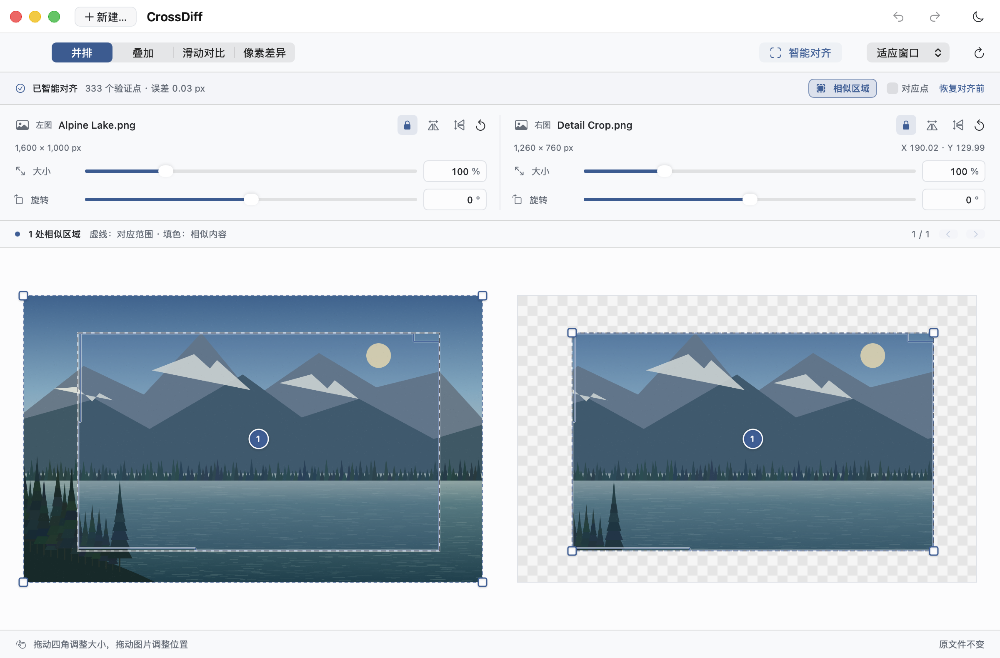
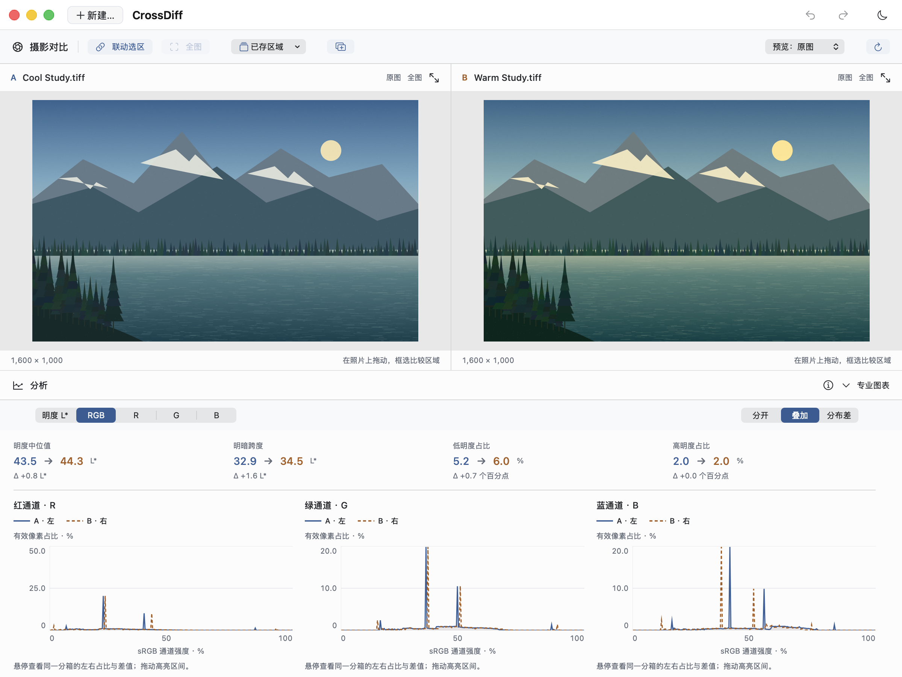
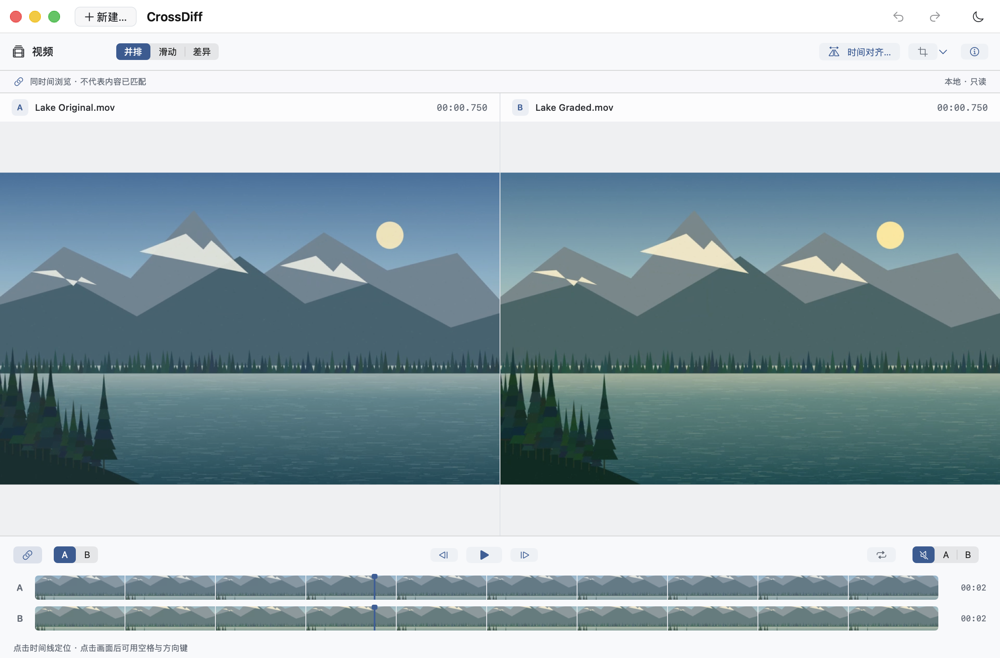
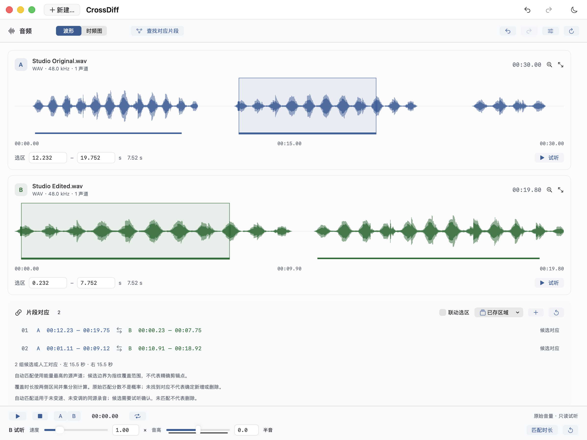
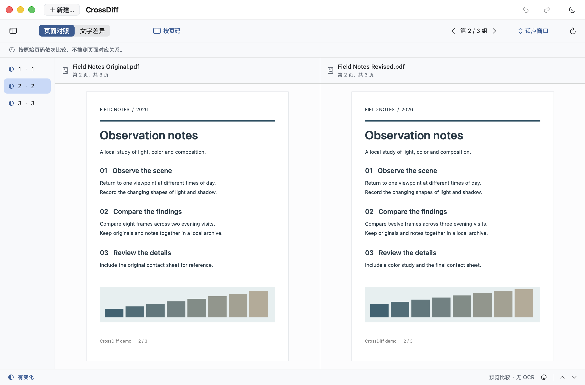
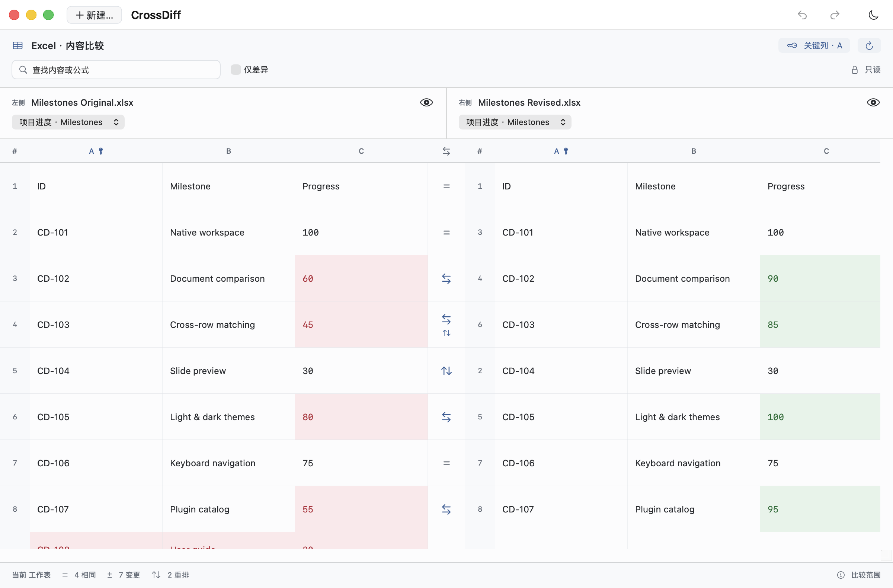
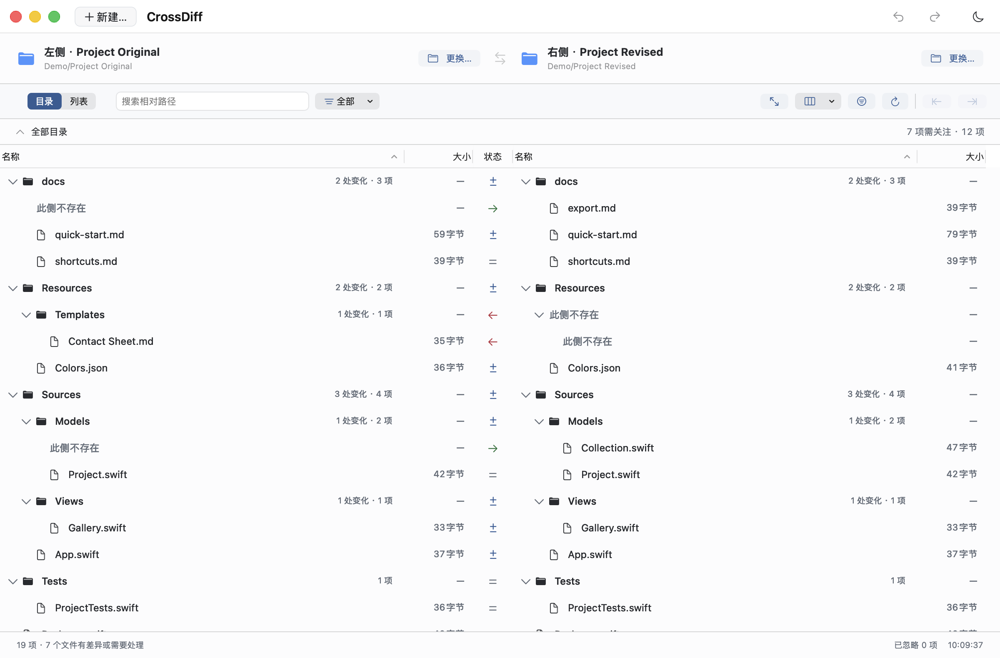
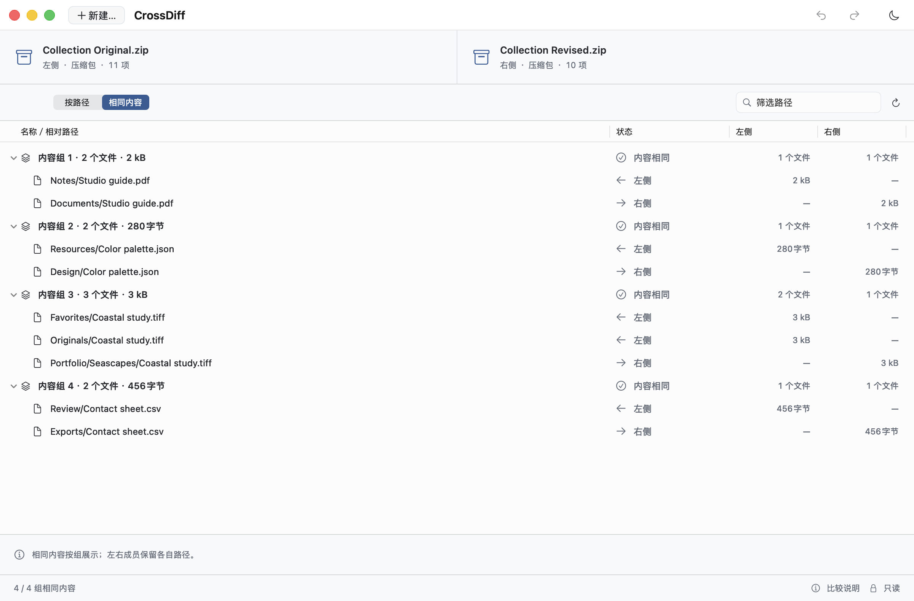
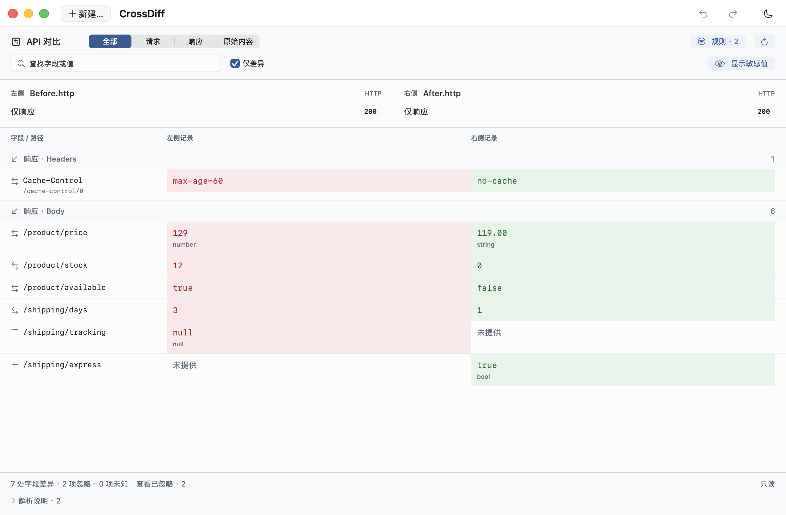
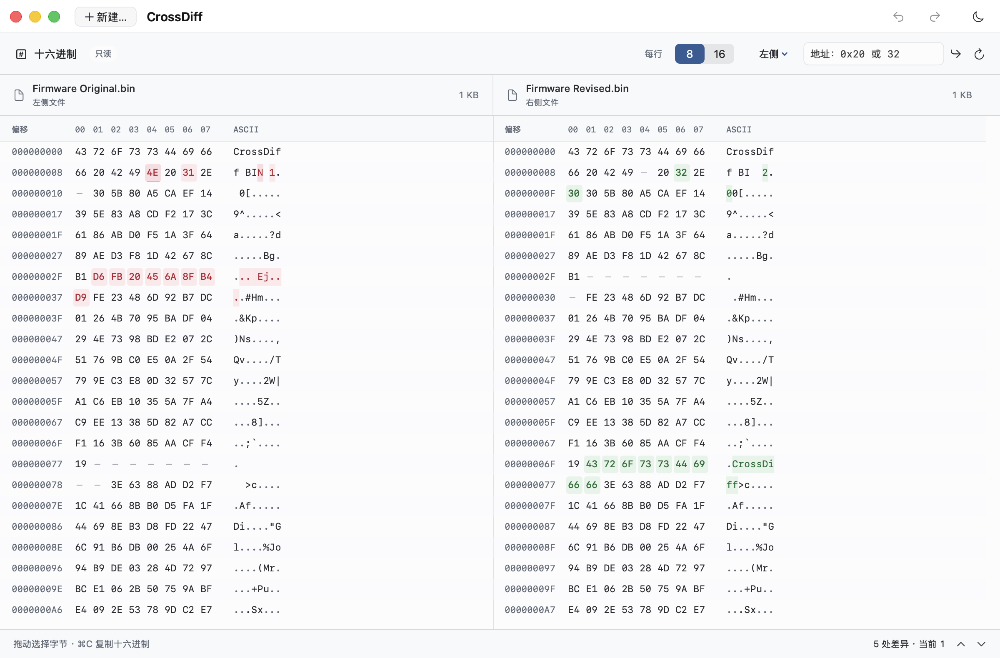

<div align="center">


<h1>CrossDiff</h1>

**对比一切，把每一处变化看清。**

为 Mac 打造的免费开源比较工作台。<br>
从文字与代码，到文档、照片、声音和视频。原生体验，本地处理，无需注册。

[简体中文](README.md) · [English](README.en.md)

[](#快速开始)
[](Package.swift)
[](LICENSE)

[快速开始](#快速开始) · [下载完整版](https://github.com/JunyangZhangUSTC/CrossDiff/releases/download/v0.15.2/CrossDiff-0.15.2-full-macOS-arm64.zip) · [功能特色](#一个工作台专注每一处变化) · [界面一览](#不同对象同一个工作台) · [选择版本](#选择适合你的版本) · [插件扩展](#用插件拓展你的比较工作台) · [隐私](#文件留在你的-mac-上)

</div>

> 🌟 **不想选版本？直接下载完整版：[CrossDiff-0.15.2-full-macOS-arm64.zip](https://github.com/JunyangZhangUSTC/CrossDiff/releases/download/v0.15.2/CrossDiff-0.15.2-full-macOS-arm64.zip)。**
>
> 适用于 macOS 14+ 的 Apple 芯片 Mac。预装本版本全部官方插件，打开即可比较。

<table>
<tr><td>
<a href="docs/assets/screenshots/text-zh-CN-light.png">
<picture>
  <source media="(prefers-color-scheme: dark)" srcset="docs/assets/screenshots/text-zh-CN-dark.png">
  
</picture>
</a>
</td></tr>
</table>

<p align="center"><sub>文本与代码：从一处字符变化到整段修改，看清差异，再决定如何合并。</sub></p>

## 一个工作台，专注每一处变化

粘贴两段文字，检查一次发布，研究一张照片，或逐帧核对剪辑。CrossDiff 为不同内容提供合适的视图，让你看见真正需要关注的变化。

| | |
| :--- | :--- |
| **为 Mac 原生打造**<br>SwiftUI + AppKit，原生编辑器、标准菜单和熟悉的快捷键。无需内置浏览器运行环境。 | **文件留在本机**<br>比较内容无需上传，无遥测或追踪。安装好插件后，可以一直离线比较。 |
| **免费开源，无需注册**<br>没有账号、订阅或付费解锁。AGPL v3 开源，源码可审查、构建和修改。 | **原文件由你掌握**<br>文本逐块合并、独立撤销、手动保存；图片与媒体调整仅影响查看，不改写源文件。 |
| **清晰，也赏心悦目**<br>浅深色主题，中英文界面，多标签与同步滚动。不同内容沿用熟悉的原生操作。 | **用插件继续扩展**<br>完整版预装八个官方插件；也可从基础版开始，在应用内下载或拖入插件安装。 |

**0.15.2 正式版**：Git 比较加入基础版，提交、分支、暂存区和工作区都能对照；多标签浏览更顺畅，摄影专业图表默认展开，并修复直方图分析报错。[查看本版更新](docs/releases/0.15.2.md)

## 不同对象，同一个工作台

以下均为真实应用窗口，图片、音视频和示例文件使用程序生成的演示素材；随 GitHub 主题切换浅深色。点击截图可打开浅色原图，查看完整细节。

### 图像与媒体

<table>
<tr>
<td width="50%" valign="top">
<p><b>图片 · 为共同内容找到对应位置</b></p>
<a href="docs/assets/screenshots/image-zh-CN-light.png">
<picture>
  <source media="(prefers-color-scheme: dark)" srcset="docs/assets/screenshots/image-zh-CN-dark.png">
  
</picture>
</a>
<p>离线智能对齐裁剪、旋转或缩放后的同源图片，结合相似区域、滑动对照与像素差异查看局部变化。</p>
<p><a href="docs/usage.md#compare-images">使用指南 →</a></p>
</td>
<td width="50%" valign="top">
<p><b>摄影 · 看懂影调与配色</b></p>
<a href="docs/assets/screenshots/photography-zh-CN-light.png">
<picture>
  <source media="(prefers-color-scheme: dark)" srcset="docs/assets/screenshots/photography-zh-CN-dark.png">
  
</picture>
</a>
<p>专业图表默认展开：RGB／Lab L* 直方图、HSL 分布与独立区域比较，让照片风格有据可看；支持由 macOS 解码的 RAW。</p>
<p><a href="docs/usage.md#photography">使用指南 →</a></p>
</td>
</tr>
<tr>
<td width="50%" valign="top">
<p><b>视频 · 把剪辑版本放在一起看</b></p>
<a href="docs/assets/screenshots/video-zh-CN-light.png">
<picture>
  <source media="(prefers-color-scheme: dark)" srcset="docs/assets/screenshots/video-zh-CN-dark.png">
  
</picture>
</a>
<p>双画面与双时间线支持手动对齐、逐帧浏览和片段循环，暂停后可滑动对照或查看帧差异。</p>
<p><a href="docs/usage.md#video">使用指南 →</a></p>
</td>
<td width="50%" valign="top">
<p><b>音频 · 看见声音里的变化</b></p>
<a href="docs/assets/screenshots/audio-zh-CN-light.png">
<picture>
  <source media="(prefers-color-scheme: dark)" srcset="docs/assets/screenshots/audio-zh-CN-dark.png">
  
</picture>
</a>
<p>波形、STFT 时频图与 A/B 试听深入局部声音，自动寻找同源录音中固定速度的对应片段。</p>
<p><a href="docs/usage.md#audio">使用指南 →</a></p>
</td>
</tr>
</table>

### 文档与办公

<table>
<tr>
<td width="50%" valign="top">
<p><b>PDF · 页面与文字，一起核对</b></p>
<a href="docs/assets/screenshots/pdf-zh-CN-light.png">
<picture>
  <source media="(prefers-color-scheme: dark)" srcset="docs/assets/screenshots/pdf-zh-CN-dark.png">
  
</picture>
</a>
<p>保留原页面的同时查看可提取文字差异，按页码、智能匹配或手动选页，对照论文与文档。</p>
<p><a href="docs/usage.md#pdf-文档与插件--pdf-documents-and-plugins">使用指南 →</a></p>
</td>
<td width="50%" valign="top">
<p><b>Office · 行重排，也能找到对应</b></p>
<a href="docs/assets/screenshots/office-zh-CN-light.png">
<picture>
  <source media="(prefers-color-scheme: dark)" srcset="docs/assets/screenshots/office-zh-CN-dark.png">
  
</picture>
</a>
<p>Word 段落、Excel 跨行匹配与可选关键列、PowerPoint 幻灯片内容，配合原文件预览只读比较。</p>
<p><a href="docs/usage.md#office">使用指南 →</a></p>
</td>
</tr>
</table>

### 文件与开发

**Git · 从提交历史到眼前的修改。** 打开本地仓库或远程克隆地址，选择分支、标签、提交，或一键查看全部未提交／已暂存／未暂存的变化。目录树定位文件，右侧双栏查看细节；全过程只读，无需切换分支。[使用指南 →](docs/usage.md#git)

<table>
<tr>
<td width="50%" valign="top">
<p><b>文件夹 · 两边始终对得上</b></p>
<a href="docs/assets/screenshots/folder-zh-CN-light.png">
<picture>
  <source media="(prefers-color-scheme: dark)" srcset="docs/assets/screenshots/folder-zh-CN-dark.png">
  
</picture>
</a>
<p>对齐目录、联动展开、排序与筛选让大型目录更易浏览，选中文件后先预览，再核验并复制。</p>
<p><a href="docs/usage.md#compare-folders">使用指南 →</a></p>
</td>
<td width="50%" valign="top">
<p><b>压缩包 · 不解压，也能看里面</b></p>
<a href="docs/assets/screenshots/archive-zh-CN-light.png">
<picture>
  <source media="(prefers-color-scheme: dark)" srcset="docs/assets/screenshots/archive-zh-CN-dark.png">
  
</picture>
</a>
<p>压缩包与压缩包或本地目录互比，按路径检查差异，也能找出不同位置的相同文件。</p>
<p><a href="docs/usage.md#archives">使用指南 →</a></p>
</td>
</tr>
<tr>
<td width="50%" valign="top">
<p><b>API · 把差异看到字段里</b></p>
<a href="docs/assets/screenshots/api-zh-CN-light.png">
<picture>
  <source media="(prefers-color-scheme: dark)" srcset="docs/assets/screenshots/api-zh-CN-dark.png">
  
</picture>
</a>
<p>本地导入 HTTP、cURL 或 HAR，检查头、参数及 JSON 的值与类型差异，明确忽略波动字段。</p>
<p><a href="docs/usage.md#api">使用指南 →</a></p>
</td>
<td width="50%" valign="top">
<p><b>二进制 · 让每个字节都有位置</b></p>
<a href="docs/assets/screenshots/binary-zh-CN-light.png">
<picture>
  <source media="(prefers-color-scheme: dark)" srcset="docs/assets/screenshots/binary-zh-CN-dark.png">
  
</picture>
</a>
<p>十六进制与 ASCII 双栏保留真实源地址，插删对齐、差异导航与地址跳转直达变化。</p>
<p><a href="docs/usage.md#binary-hex">使用指南 →</a></p>
</td>
</tr>
</table>

<details>
<summary><b>格式与能力范围</b></summary>

- **文本与代码**：支持 TXT、Markdown、HTML、JSON、XML、YAML 等文本文件；查找替换、撤销重做和“显示删除”只读审阅均可用。
- **Git 仓库**：本地仓库、裸仓库与 worktree，或主动获取 HTTPS／SSH 远程仓库。支持历史与未提交修改，只读查看；需要系统 Git，单文件详情预览最多 2 MiB。
- **压缩包与办公文档**：支持 ZIP、TAR 与常见压缩 TAR，以及无密码、单卷 7z 和受限 RAR；Office 支持 DOCX／XLSX／PPTX，旧格式需先转换。
- **图片与摄影**：智能对齐面向有足够共同细节的同源图片；RAW 解码取决于机型、编码和系统版本。摄影分析不反推拍摄参数，有记录才显示处理曲线。
- **音频与视频**：音频的自动变速／变调识别、视频的自动剪辑匹配尚未实现。视频差异图要求同像素尺寸与明确的 Rec.709 SDR 标记，HDR 保留视觉浏览。
- **PDF 与 Hex**：PDF 尚无 OCR；Hex 每侧最多 8 GiB，复杂区域会明确标注粗略对齐。更多限制见[使用指南](docs/usage.md)与[实现说明](docs/development.md#current-implementation-limits)。

</details>

## 选择适合你的版本

**上方下载对应 0.15.2 · macOS 14+ · Apple 芯片（arm64）**

本版功能与限制见[发布说明](docs/releases/0.15.2.md)，本地验证范围见[验收记录](docs/validation/README.md)。

**推荐完整版 Full：基础功能与本版本全部官方插件一次备齐。** 包含压缩包、Git、PDF、摄影、API、音频、办公与视频八个官方插件，下载后即可使用。

只需要文本、文件夹、图片、Git、Hex 和压缩包比较时，可以选择基础版 Base。两版均免费、开源，无需账号。

<details>
<summary><b>查看基础版、独立插件和其他下载文件</b></summary>

基础版与完整版的区别在于预装插件；之后也可以按需安装。

| 下载 | 包含内容 | GitHub Release 文件 |
| :--- | :--- | :--- |
| **完整版 Full（推荐）** | 基础版加对应版本的全部官方插件，具体内容见上方版本说明。 | `CrossDiff-<版本>-full-macOS-arm64.zip` |
| **基础版 Base** | 文本、文件夹、图片、Hex，以及内置 Git 与压缩包插件。轻装开始，按需添加插件。 | `CrossDiff-<版本>-base-macOS-arm64.zip` |
| **独立插件** | 按宿主版本安装兼容插件；已内置的插件随应用升级。 | `CrossDiff-Plugin-<名称>-<插件版本>.crossdiffplugin` |

**[前往 GitHub Releases 下载 →](https://github.com/JunyangZhangUSTC/CrossDiff/releases)**

在版本的 **Assets** 中选择文件；每次发布另附对应源码、构建信息和 `SHA256SUMS`。插件需要兼容宿主；JSON 仅作为独立开发示例，不预装进 Full。

</details>

Intel 构建尚未实测。也可按下方说明从源码构建。

## 用插件拓展你的比较工作台

打开 **新建… → 更多对比项**，或 **CrossDiff → 插件…**。

- **在应用内安装：** 在“发现插件”页选择 **下载并安装**。应用从对应 GitHub Release 获取插件包，校验后自动完成安装。
- **下载后安装：** 从 Release 的 Assets 下载 `.crossdiffplugin`，拖入 CrossDiff，或在插件页选择本地文件。
- **管理已安装插件：** 插件页默认显示“已安装”，卡片上可直接启用、停用或**卸载**本地安装的插件，更新后也可回退。
- **整理预装插件：** 完整版等预装插件可**移除**并随时离线**恢复**。移除状态会保留，原文件和比较会话不受影响；预装文件仍随应用保留，不会减小应用体积。

官方插件列表可以离线查看。**文件比较留在本机；插件下载和远程 Git 仓库获取仅在你主动操作时联网。** 不需要注册 CrossDiff 账号。

Git、压缩包等基础能力也由内置插件提供，不同领域沿用一致的原生工作台。希望开发新的比较方式？查看[中文插件规范](docs/plugins/development.md)、[English guide](docs/plugins/development.en.md) 和 [JSON 示例](Plugins/Examples/JSON/compare.js)。

## 快速开始

下载[完整版](https://github.com/JunyangZhangUSTC/CrossDiff/releases/download/v0.15.2/CrossDiff-0.15.2-full-macOS-arm64.zip)，解压并打开 **CrossDiff.app**。无需安装 Swift 开发工具。

1. 点击 **新建…**（⌘N），选择文本、文件夹、图片、Git、二进制、压缩包或其他已安装插件。
2. 分别准备左右内容，点击 **开始比较**。文本可直接粘贴或选择文件；Git 则先打开仓库，再选择两侧来源。
3. 查看差异；文本可编辑任意一侧、逐块合并，并在准备好后手动保存。

**文件 → 打开…**（⌘O）支持一次选入多个文件或文件夹，明确配对后各自打开标签页。“清空两侧”方便开始下一次文本比较，并提供即时恢复。完整说明见[使用指南](docs/usage.md)，也可用仓库内的 [Swift 示例](examples/) 体验。

### 首次在 macOS 上打开

当前发行包尚未使用 Apple Developer ID 签名或公证，构建使用 ad-hoc 签名。因为开发者计划的年费成本，目前需要你在首次打开时手动确认一次。

确认下载来自本仓库 Release 后：

1. 解压并尝试打开 **CrossDiff.app**。
2. 若系统提示无法验证开发者，前往 **系统设置 → 隐私与安全性**，点击 CrossDiff 对应的 **仍要打开**。
3. 确认 **打开**，按系统提示完成验证。之后通常可以直接双击启动。

这是 [Apple 官方提供的打开方式](https://support.apple.com/zh-cn/102445)，无需全局关闭 Gatekeeper。源码公开，发布附带校验和，你可以审查、核对或自行构建。更多信息见[发布指南](docs/releasing.md)。

<details>
<summary><b>常用快捷键</b></summary>

| 操作 | 快捷键 |
| :--- | :--- |
| 新建比较 / 打开文件或文件夹 | ⌘N / ⌘O |
| 撤销 / 重做 | ⌘Z / ⇧⌘Z |
| 查找 / 查找并替换 | ⌘F / ⌥⌘F |
| 下一个 / 上一个匹配 | ⌘G / ⇧⌘G |
| 下一处 / 上一处差异 | ⌥⌘↓ / ⌥⌘↑ |
| 保存当前编辑侧 | ⌘S |
| 设置 / 切换语言 | ⌘, |

在 **CrossDiff → 设置/Setting… → 语言/Language** 中选择简体中文或 English，界面即时更新，无需重启。

</details>

<details>
<summary><b>从源码构建</b></summary>

安装支持 **Swift 6.0 package manifest** 的开发工具，在项目根目录运行：

```sh
bash scripts/build-app.sh
bash scripts/open-dev-app.command
```

首次构建会下载经 SHA-256 固定的 OpenCV 4.12.0 源码，仅编译 `core`／`imgproc`／`features2d`／`calib3d`／`flann`；缺少 CMake 时也会在项目内准备。依赖、工具与缓存均保存在 `.build/photo-deps/`，不全局安装。

项目使用 Swift 5 语言模式，构建本机架构。应用生成在 `dist/CrossDiff.app`。开发启动入口将会话、偏好与缓存留在当前项目，不安装全局依赖或写入 `/Applications`。版本打包与发布见[发布指南](docs/releasing.md)。

</details>

## 文件留在你的 Mac 上

内置比较与受限插件在本机处理文件，**不上传比较内容**。没有账号系统、遥测、分析追踪或云端同步；安装插件后，断网也能继续比较。联网仅服务于你主动发起的插件下载或远程 Git 仓库获取；本地仓库比较无需联网。

临时比较可在本机恢复，也可通过“会话”菜单清除记录。会话以明文保存文本与路径；存储位置、第三方插件权限及安全报告方式见 [SECURITY.md](SECURITY.md)。

## 对比一切，持续向前

我们的方向是 **“对比一切，把对比这件小事做到极致”**。从日常比较出发，用可扩展的数据来源、算法和专业视图，逐步连接更广阔的工作场景。

| 已经可以使用 | 接下来探索 |
| :--- | :--- |
| 文本、文件夹、图片、Git、Hex、压缩包、PDF、摄影、API、音频与办公文档；视频手动对照 | 远程文件夹来源、文本三方合并、多对象比较 |
| 原生工作台、插件安装管理、基础版与完整版 | 旧版 Office 与完整视觉比较、网络包、数据库、摄影高级分析、模型结构与张量插件；音频自动变速／变调识别、视频自动片段对应 |
| 中英文界面、浅深色主题、本机会话恢复 | 面向摄影师、媒体工作者与开发者的插件组合 |

右侧为**未来规划**。当前提供两方比较；PDF 尚无 OCR，压缩包尚不支持密码、分卷及部分 7z／RAR 特性，文件夹尚不支持完整同步。文件上限、RAW 兼容性和各类分析边界见[路线图](docs/roadmap.md)与[实现说明](docs/development.md#current-implementation-limits)。

欢迎通过 [Issues](https://github.com/JunyangZhangUSTC/CrossDiff/issues) 反馈问题和建议，一起把比较体验打磨得更好。[贡献指南](CONTRIBUTING.md) · [开发指南](docs/development.md) · [产品方向](docs/product-vision.md) · [更新记录](CHANGELOG.md)

## 许可证

Copyright © 2026 **Junyang Zhang**。CrossDiff 使用 [GNU Affero General Public License v3.0](LICENSE)（`AGPL-3.0-only`）。项目版权说明见 [NOTICE](NOTICE)。
