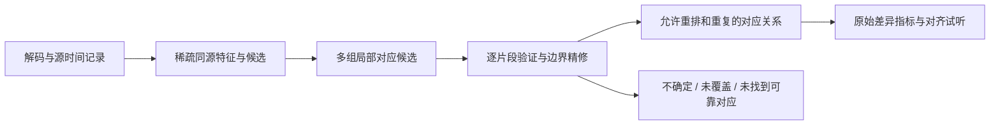

# 音频对比插件：研究与设计提案

状态：2026-10-02，**0.11.0 首轮实现与后续设计**。现已实现原生音频工作台、手动区域/试听，以及 Olaf 固定速度同源片段候选；Full 预装 Audio 0.1.0，Base 可安装。独立变速/变调自动识别、连续速度曲线、全长高分辨率图块等仍属后续。本文件以下章节保留长期设计目标，不代表每个候选或参数已交付；实际行为见[使用指南](../usage.md#audio)与[验收记录](../validation/audio-0.11.0.md)。

## 1. 目标与难度判断

用户已确认：同时覆盖音乐与语音，优先识别**同一录音经过剪辑、拼接、重排、变速或变调的版本**。波形、频谱与 STFT 时频图提供默认配置和可展开的专业参数；同时提供自动对应和手动区域对齐。手动操作仅改变比较映射与试听，不覆盖源文件。

这是可工程化的目标，但不是接入一个 DTW 函数就能完成的功能：

| 范围 | 判断 | 实施方式 |
| --- | --- | --- |
| 波形、频谱、STFT、区域选择与 A/B 试听 | 成熟工程能力 | Apple 解码、DSP 与播放接口，辅以数值和界面验证 |
| 同源录音的偏移、剪切、插入、重排、重复使用 | 有成熟识别方法，需要组合成产品 | 指纹发现多个候选，再验证和精修片段边界 |
| 片段内恒定的变速、变调，或两者独立变化 | 有权威研究和实现，适用范围必须实测 | 验证 Panako 等候选；不能把整段成功外推到所有短剪辑 |
| 连续速度曲线、极短片段、叠加混音、严重失真 | 困难或本身多解 | 后续能力；首版保留不确定候选和人工对齐 |

只有两个输入，可以省去大型检索服务与长期指纹库，却没有省去未知位置、未知变换及多解问题。双方各 30 分钟、每秒 20 帧的稠密相似度矩阵就有 12.96 亿个元素，单个 Float32 矩阵约 **4.83 GiB**，还不含累计分数、特征和回溯。这是维度计算，不是性能实测。因此主流程应采用稀疏候选和局部精修，不能默认计算两条长音频的完整高分辨率矩阵。

不同演奏、翻唱、同一句话的重新录制属于另一种相似性任务。旋律、和声或转录文字相同，不足以证明是同一录音；首版不将它们混入同源判断。

研究依据分别记录在[局部对齐](../research/audio-local-alignment.md)、[指纹与变换识别](../research/audio-fingerprinting.md)、[原生分析与试听](../research/audio-native-analysis.md)中。

## 2. 用户看到什么

插件名建议为 **音频对比 / Audio Compare**，沿用现有“新建… → 选择类型 → 准备两个输入”的流程。首次打开先展示波形，用户点击“查找对应片段”后运行自动分析；选择区域后也可执行“在另一侧查找”。不自动播放，不把分析完成与开始播放绑定。

建议默认采用上下排列的 A/B 两条宽时间线，保留 CrossDiff 现有工具栏、颜色和留白。音频主要沿时间轴阅读，上下布局比强行将时间轴分成两个窄栏更便于观察；这是音频专用视图，不改变现有图片和文本的双栏布局。

- 顶部保留打开/更换输入、波形/时频图切换、自动分析和可折叠参数。
- 每条时间线显示文件名、时长、格式、采样率及声道，并显示可缩放的波形。立体声可展开为独立声道，不能默认混成单声道后丢失相位抵消等问题。
- 对应片段使用稳定的颜色与编号；选中时才突出两端和连接关系，避免把全部连接画成杂乱的线网。颜色之外提供文字和图形标识。
- 底部共用播放控制：播放/暂停、A/B 切换、选区循环、前后对应片段。默认保持原始音量；响度匹配为显式试听选项。
- 侧边检查器默认只显示选中片段的双方范围、时长关系、音高变化估计、对应证据和完成状态。频谱、专业指标、算法参数按需展开。
- “原始时间轴”保留真实剪辑顺序；“对齐试听”针对选中的一对片段。允许一对多和乱序时，不能声称存在唯一全局同步播放位置。

示例对应关系：左侧 `A—B—C`，右侧 `C—A—A`，应能选中 `C↔C`、`A↔A₁`、`A↔A₂`；B 显示“未找到可靠对应”。未匹配可能来自真正移除、变换过强或分析未覆盖，不能一律标为确定删除。

默认摘要以“发现 4 组对应；A 侧覆盖 38 秒；B 侧覆盖 52 秒；2 处待确认”等可解释事实为主。两侧覆盖分别计算时间区间并集，重复匹配不反复累计。暂不提供含义不明确的“整体相似度 87%”。

## 3. 手动对齐与只读试听

显示缩放与音频变速是两个独立操作。缩放时间轴只影响查看；修改比较映射需要显式进入“调整对应”状态。

1. 两侧独立选择范围，保存命名的区域对；支持多组区域反复切换。
2. 拖动对应区域可调整时间偏移；拖动边界调整选择范围。单独启用“时间伸缩”后，拖动映射手柄改变相对时长，避免普通选区手势意外变速。
3. 显示可编辑的偏移、试听速度和音高数值，并提供重置、撤销和重做。局部设置只作用于选中区域对，不能以一个全局播放倍率冒充局部伸缩。
4. 区分“改变速度并联动音高”“保持音高改变速度”“仅改变音高”。首版局部区域采用恒定参数，连续速度曲线留待后续。
5. 原始试听与补偿后试听明确标记。自动识别估计值、用户调整值和用于显示的时间映射分别保存，不能用试听补偿掩盖原始差异。

Apple 的 [AVAudioUnitTimePitch](https://developer.apple.com/documentation/avfaudio/avaudiounittimepitch)提供独立 rate/pitch 调整，可作为试听基础；分段播放调度、边界平滑、A/B 延迟补偿仍需宿主实现和验证。备用的 [Rubber Band](https://github.com/breakfastquay/rubberband)是成熟变速变调库，但不是自动片段匹配引擎；只有试听质量或能力验证说明必要时再引入。

联动改变速度和音高的试听使用 [AVAudioUnitVarispeed](https://developer.apple.com/documentation/avfaudio/avaudiounitvarispeed/rate)等对应机制；同时设置 TimePitch 的 rate/pitch 不应被描述为与真实重采样完全等价。

播放切换需避免爆音，支持键盘、焦点与可访问性。暂停、关闭标签或取消任务后释放播放资源。音频变化、拖动区域与调整参数不能写入用户输入文件。

## 4. 原生分析管线与图表口径

优先使用 Apple AVFoundation / AVFAudio 进行解码、分块读取、定位、采样率转换和播放，使用 Accelerate/vDSP 的 FFT、窗口与统计操作。无需从矩阵运算重新发明 DSP 算法；CrossDiff 负责分帧、配置、缓存与严格标定。[AVAudioFile](https://developer.apple.com/documentation/avfaudio/avaudiofile)、[Accelerate FFT 示例](https://developer.apple.com/documentation/accelerate/finding-the-component-frequencies-in-a-composite-sine-wave)

| 展示或指标 | 数据与定义 | 必须保留的边界 |
| --- | --- | --- |
| 波形 | 原始解码 PCM 的多级 min/max 包络，可叠加 RMS | 缩略包络仅用于绘图，不能拿来计算频谱 |
| 频谱 | 当前选区的窗函数 FFT 功率统计 | 明确平均方式、频率和幅度单位，不与瞬时频谱混淆 |
| STFT 时频图 | 逐帧加窗 FFT；时间×频率×强度 | 统一窗长、hop、窗增益和 dB 参考值，保留分析采样率 |
| 音量变化 | 峰值、RMS；需要响度时采用标准 LUFS 实现 | RMS 不等于响度；样本峰值不等于真峰值 |
| 声道信息 | 左右声道及可选 Mid/Side 分析 | 匹配用降混音频和用户观察的原始声道分别保留 |
| 频谱差异 | 在已确认对应的范围内比较功率分布 | 不把未对齐波形直接相减当作有效差异 |

原型起始配置建议：分析副本使用共同采样率 48 kHz，Hann 窗，2048 点 FFT，hop 512；窗口约 42.7 ms、步长约 10.7 ms。**0.11.0 已采用并通过数值校验；它是产品默认值，不是行业标准。** 低采样率输入升采样不会新增真实高频信息，超出源信号有效频带的部分不能显示为新增细节。匹配器可按其官方要求使用另一套采样率与特征，不与显示图表的配置捆绑。

默认 48 kHz 图谱最多分析到 24 kHz，不能覆盖原始 96/192 kHz 文件的全部频带；更高分析采样率属于后续专业参数；当前仍固定 48 kHz。分析副本不改变原始文件和原始试听的数据路径，设备播放格式转换另行处理。

专业面板允许选择分析预设、FFT/窗长、hop、线性/对数频率轴、可见频带、dB 范围和声道。更改显示范围不重跑识别；更改分析参数只重算受影响工件。零填充增加绘图采样密度，不提高由窗时长决定的频率分辨能力。

两侧默认共用频率与 dB 标尺，不分别自动拉伸颜色而制造或掩盖差异；时频图使用连续、可辨读的色阶。显示“幅度 dBFS”或“功率谱密度 dBFS/Hz”等单位必须与实际归一化一致。校验要覆盖已知振幅正弦、脉冲、静音、双音、不同窗长和声道。

Apple 的音频可视化示例不全是 STFT：[Visualizing sound as an audio spectrogram](https://developer.apple.com/documentation/accelerate/visualizing-sound-as-an-audio-spectrogram)采用 DCT，不能直接照搬后标成 STFT。若添加 LUFS/响度匹配，优先验证 [libebur128](https://github.com/jiixyj/libebur128)与 ITU/EBU 测试材料；默认仍以原始音量试听。

格式支持按系统解码器实际能力探测，不按扩展名承诺。首批测试覆盖 WAV、AIFF、FLAC、MP3、AAC/M4A；特殊编码、受保护内容、损坏数据和多轨文件分别给出明确状态。此清单是验收目标，不是已验证的支持列表。

## 5. 自动比较：候选发现、局部精修、对应关系

推荐流程：



识别阶段允许使用对音量、编码或变换相对稳定的特征，以便找到同一来源；测量阶段回到原始信号与已知映射，报告音量、速度、音高和频谱差异。**不能先将差异全部归一化掉，再告诉用户音频完全一样。**

保留简单情况的快速路径：相同文件摘要可直接确定文件字节相同；摘要不同仍可能只是容器元数据或编码差异。文件字节相等、解码样本相等和识别出同源片段分别表述，不混成一种“相同”。

| 方案 | 推荐角色 | 不承担什么 |
| --- | --- | --- |
| [audfprint](https://github.com/dpwe/audfprint) | 同源指纹基线，验证剪辑片段定位和普通转码/噪声条件 | 不据此承诺独立变速变调；时间支持区间不等于精确剪辑边界 |
| [Panako](https://github.com/JorenSix/Panako) | 变速、变调增强识别的优先实验候选 | 不能直接将单次 query/monitor 输出视为完整重排 diff |
| [Olaf](https://github.com/JorenSix/Olaf) | 较轻量的 C 实现候选，评估原生分发和基础同源定位 | 不因同作者或语言更轻量而假定具有 Panako 同等变换能力 |
| [libfmp](https://github.com/groupmm/libfmp) 局部对齐 | 双方未知起止的局部路径参考实现，音乐结构辅助分析 | 一个最高分单调路径不能表示所有重排/复制关系 |
| [Sync Toolbox](https://github.com/groupmm/synctoolbox) / MATCH | 结构相近或已经配对的音乐片段内的参考同步器 | 不作为任意音乐与语音剪辑的统一发现引擎 |
| [SciPy correlate](https://docs.scipy.org/doc/scipy/reference/generated/scipy.signal.correlate.html) | 小范围、近似未变形信号的时延精修和基准验证 | 原始互相关不是自动归一化的相似度，也不是任意变速检测 |

FMP 的 common-subsequence 方法比整段 DTW 更符合双方起止未知的需求，但参考代码默认找到一个最佳局部路径；多段选择、重叠消解和一对多必须另外设计。Chroma 具有音乐音级结构意义，不单独用来确认语音同源；循环移位也不能区分所有八度差异。[FMP 方法说明](https://www.audiolabs-erlangen.de/resources/MIR/FMP/C7/C7S3_CommonSubsequence.html)

**已执行的原型顺序：audfprint 基线 → Panako 变换识别 → Olaf 原生可交付性比较。** FMP/Sync Toolbox 提供局部对齐与音乐辅助基准。每个候选固定提交和配置；最终分发引擎由统一语料的准确性、边界精度、资源占用和打包实验决定。0.11.0 根据初步实测选择 Olaf C 作为固定速度候选引擎；Panako 独立变速/变调实验已跑通部分案例，但短片段和组合变换不稳定，因此未进入生产依赖。详见 [M0 实测](../validation/audio-matching-m0.md)。

Panako 的独立变速/变调设计最贴近增强目标，但其 Java、原生桥接及相关依赖与 CrossDiff 当前受限 JavaScript 插件不同；官方 README 的旧 M1 安装段落与后续 M1 支持变更记录还存在差异，需要固定版本实际构建确认。Python 参考库不应直接变成要求最终用户自行安装的环境。

已核查的接入陷阱：`panako same` 实际调用 Olaf 策略；Panako 策略的一次查询对同一参考文件只拟合一组对应，不能靠增大结果数量找全剪辑。原型需要显式选择策略、多窗口/双向候选、完整尾段覆盖，并关闭默认磁盘缓存后使用会话内存索引。默认最短匹配为 5 秒，对短语音尤其需要单独测试；改小阈值不等于解决可靠性。具体源码和包装建议见[指纹研究](../research/audio-fingerprinting.md)。

audfprint 也需要长文件配置校验：默认时间字段约 6 分钟后发生混叠，不能直接用于长播客；同一时间偏移的多个分离片段还可能被返回成一个外包区间，必须检查内部连续性。两个候选的现成命令都不能未经适配就当作产品结果。

一次比较可建立会话级的双文件索引，无需联网或长期保存全盘指纹库。重复片段与重排应保留多个时延簇或局部路径，必要时反向搜索验证；不能在全局只取一个最高峰。对静音、持续纯音等低信息量区域允许拒识。片段内部映射保持单调，片段之间允许交叉。

## 6. 结果模型与插件边界

以下保留长期领域模型草案；0.11.0 已有的简化契约以 [AudioComparison.swift](../../Sources/CrossDiffCore/AudioComparison.swift) 与[插件开发指南](../plugins/development.md)为准：

```text
AudioSource
  inputID, sourceRevision, trackID, sampleRate, channelLayout, frameCount
AudioRegion
  sourceID, trackID, startFrame, endFrame
AudioCorrespondence
  id, regionA, regionB, timeMapping, pitchRelation
  evidence, methodVersion, verificationState, uncertainty
AudioComparison
  correspondences[], analysedCoverageA/B, unresolvedRegions[], parameters
AudioPreviewState
  selectedPair, displayRange, userTimeMapping, auditionRate/Pitch, gainMode
```

源定位使用原始采样帧或有理时间，并记录重采样、解码延迟与预览映射；显示秒数不代替精确定位。经 JSON 传递的 64 位帧编号采用现有无损十进制字符串规则，避免 JavaScript 数值精度损失。自动结果与手动覆盖分别保存，重新分析不能悄悄丢失用户的区域设置。

每一对区域可包含时间锚点和估计误差。首版可先支持仿射映射；未来扩展分段映射时保持来源定位不变。公开字段避免含义不明确的 `speed=1.2`：分析记录两侧时长关系，试听另存明确的播放倍率。匹配评分、人工确认和经过标定的概率分开，不把原始指纹计数标成“97% 可信”。

映射方向固定为 A → B：`tB = a × tA + b`，其中时间先按各源采样率换算成秒/有理时间，`a = ΔtB / ΔtA`；不能用采样率不同的原始帧数之比代替时长之比。音高差约定为 B 相对 A 的半音变化；该估计不自动等于用户应设置的试听补偿值。

0.11.0 已新增 `audioAnalysis` 输入与 `audioTimeline` 原生视图。受限插件只接收元数据和有界对应证据，不接收 PCM；Apple 分析、试听与 Olaf helper 由宿主提供，长任务独立于 JavaScript 执行超时。尚未开放第三方 PCM/图块读取句柄。

建议分工：

- `CrossDiffCore` 保存时间范围、对应关系、参数与结果校验；继续不依赖 AppKit/SwiftUI。
- macOS 宿主服务负责获准文件的解码、波形金字塔、谱图图块、播放、资源预算与原生视图。
- 经过验证的音频引擎负责特征、同源候选和局部对齐；长任务需要独立的进度、取消、分块结果与失败恢复协议。
- 插件贡献比较能力、设置与版本化领域结果；大型 PCM、整张频谱和所有特征不塞进一条 JSON 消息。使用宿主管理的有界工件与句柄，并校验任务归属、范围、生命周期和来源版本。

原生第三方引擎的集成路线需要单独验证：由宿主提供受控音频计算服务，或真正隔离、具有限定读取能力的辅助进程。普通 native helper 不自动等于安全沙箱，不能把现有完全信任模式静默冒充受限插件。只有实现了实际权限约束，界面才能作相应说明。

同版本 Base/Full 宿主必须具备插件需要的视图与协议；基础版安装音频包后不能因缺少编译进宿主的 renderer 而失效。纯图表功能与增强识别依赖可以分层加载，但具体包拆分等引擎选型后确定。第三方源码、许可证和依赖以固定版本纳入构建；对上游额外分发声明逐项核查。

## 7. 可验证的研发顺序

### M0：真实算法基线与选型

在项目内建立隔离实验环境与固定语料清单，先运行上游实现，不同时编写新算法与评估它。音乐和语音分组报告；合成信号只验证数值正确性，不能代替真实语音与音乐识别测试。使用许可清楚的真实素材，按原始录音划分开发集和保留测试集。

| 测试组 | 样例与目的 |
| --- | --- |
| 基本变化 | 精确复制、偏移、截断、删除、插入、乱序、重复、一对多 |
| 编码与声道 | 转码、采样率变化、增益/EQ、双声道交换、单声道、反相抵消 |
| 时间和音高 | 联动变速、保调变速、独立变调、二者叠加；整段与逐片段分别测 |
| 困难片段 | 短语音、静音、持续音、重复鼓点、噪声、交叉淡化、部分混音、速度渐变 |
| 负样本 | 同一句话不同录音、相似和弦的不同作品、同类环境声、完全无关内容 |
| 资源与体验 | 长音频、连续改参数、取消/重开、文件变更、内存/缓存上限、损坏文件 |

统计片段检出率、错误对应时长、双侧匹配覆盖、边界误差、时间/音高估计误差，以及耗时和峰值内存。高覆盖不代表配对正确：基于允许的一对多片段真值，以及预先固定的时间误差/区间重叠门槛，分别评价配对正确性与覆盖。重复片段允许多解，不将一个任意唯一配对当作唯一正确答案。调阈值后使用保留测试集验证；支持范围由测试结果决定，不预先宣称任意速度或任意半音变化均可识别。

M0 的交付是可重复运行的测试命令、固定版本、结果表和引擎选择依据。0.11.0 已执行初步合成与真实音乐/语音匹配实验，尚不是大规模准确率基准；不能据此给出泛化识别率。

### M1：完整的只读音频工作台

实现格式探测、渐进波形与 STFT、选区、A/B 和循环试听、手动对应、区域保存、只读变速变调；包括插件安装、Base/Full 一致性、中英文、浅深色和最小窗口验证。音频数据按块处理，缓存有配额且可清除；取消和旧任务版本不能污染新结果。

### M2：同源片段自动比较

接入 M0 胜出的引擎，打通多个局部片段、剪辑重排、重复引用、边界精修、可解释结果与自动到手动的衔接。将经验证的恒定变速/变调纳入首个对外自动能力版本；不为赶版本把它悄悄降成仅支持整段偏移。范围外案例清楚显示不确定性，保留人工配对。

### M3：进阶对应与解释

连续速度曲线、交叉淡化/混合来源、复杂声道映射、更多专业指标，以及可展开的交叉相似图。各项依据实际用户素材与 M0 失败案例推进，不把“加入神经网络”当作通用解决方案。

所有实验代码、缓存、依赖、测试素材和构建产物继续严格留在项目目录。识别和试听在本机完成；0.11.0 为源码开发预览，不代表已发布到 GitHub。
