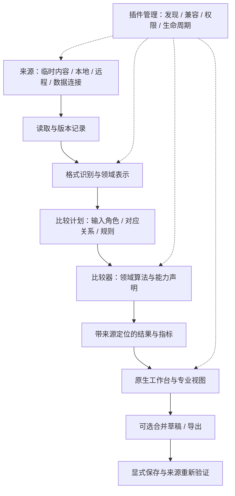

# 可扩展比较框架设计

状态：**长期架构提案，非稳定 SDK**。2026-10-01。

0.5.0 已落地第一步：版本化插件协议、受限 JavaScriptCore helper、显式完全信任原生执行、事务安装与原生页面／表格视图。实际 v1 格式和边界以[插件开发规范](../plugins/development.md)为准。本文中的远程来源、三方会话、分页工件、任意原生视图和多发行组合仍为后续目标。

0.7.0 将压缩包比较作为基础版内置插件接入同一机制：`ArchiveCatalog` 提供只读虚拟目录与 SHA-256 摘要，受限 JavaScript 产出路径配对与同内容组，宿主校验引用、覆盖范围和内容证据后以原生目录树展示。算法插件不接触宿主绝对路径或归档 bytes；来源授权与读取预算仍属于宿主。其他基础比较功能暂保持原有实现。

产品决定见 [产品方向](../product-vision.md)；领域用语见 [术语表](../../GLOSSARY.md)；技术依据见 [插件机制研究](../research/plugin-frameworks.md)、[来源与二进制研究](../research/sources-and-binary-diff.md)、[领域与迁移研究](../research/comparison-domains.md)。其中的库、运行时与专业视图路径须经过原型验证，不能仅凭接口图确定可行性。

## 1. 一条可组合的比较链



来源、格式、比较算法、展示与写入分别变化。一个 SFTP 文本文件与一个本地文本文件进入同一文本比较器；一个目录中的文件，也能在用户选择后交给图片、PDF 或二进制比较器。

这里的分层是职责，不要求立即建立七个公开 SDK 或七个 Swift target。先用现有文本和图片，以及真实 PDF 插件检验接口是否足够小、行为是否集中，再冻结对外契约。

## 2. 宿主负责什么，插件负责什么

| 模块 | 对调用方提供的行为 | 不混入的职责 |
| --- | --- | --- |
| Source Access | 列举、元数据、按需读取、版本信息、取消；可选写入能力 | 决定文字、像素或张量是否相同 |
| Representation | 受预算约束的识别、解码、来源映射和伴随资源发现 | 静默改写原始文件，执行内容内的代码 |
| Comparison Engine | 检查输入与比较方式是否支持，按规则渐进产出领域结果 | 任意访问文件系统、直接覆盖输入、控制主窗口 |
| Session Coordinator | 输入角色、任务版本、进度、取消、结果生命周期、恢复 | 将所有领域结果压成文本行差异 |
| Presentation | 原生工作台、领域视图、定位、选择、搜索和可访问性 | 将缩略图或提取文本冒充原始数据 |
| Output Coordinator | 合并草稿、撤销、导出计划、保存前重新核对 | 默认执行数据库更新或远程覆盖 |
| Plugin Manager | 清单、版本、能力注册、信任、启停、兼容与故障处理 | 把插件声明的权限当作实际隔离保证 |

内置能力与外部插件应参与同一套能力发现和路由。内置文本编辑器可保留进程内执行以保护原生编辑体验；“使用同一契约”不要求所有已有代码都跨进程。

## 3. 输入角色与比较方式

比较会话不再以永远只有 `left` 和 `right` 作为框架模型，但已有文本双栏可以继续使用内部的 `Side`。

```text
ComparisonPlan
  mode: pairwise | threeWayMerge | multiSubject
  inputs: [InputID → role + snapshot]
  correspondence: 由比较器识别或用户指定的对象对应关系
  comparator: 稳定标识 + 算法/契约版本
  options: 经过 schema 验证的比较规则
  output: 可选，独立于输入
```

- `pairwise`：恰好两个输入。
- `threeWayMerge`：恰好 `base`、`ours`、`theirs` 三个输入；结果是第四个独立对象。没有共同原始版本时，不悄悄把其中一份当 base。[三方版本的含义](https://git-scm.com/docs/git-merge)与 Git 的共同祖先／两侧修改概念一致，但本产品不要求输入来自 Git。
- `multiSubject`：多个同级对象，必须声明比较关系，例如“各对象相对选定基准”或“用户指定的若干配对”。框架支持多个输入不意味着默认启动所有两两组合，也不意味着每种插件都支持无限输入。
- 比较器明确声明支持的模式、输入数量上限、是否支持合并、输出格式与精度。单纯 `inputs.count >= 2` 不能代表具备多方比较算法。
- 文本三方合并需要处理相同修改、非重叠修改、同位置插入、修改对删除、换行差异等情形；未经解析的冲突不得被标为已解决。
- 任意三张图片更适合基准图加候选切换或网格；不提供没有领域意义的“自动三方合并图片”。

## 4. 数据来源互比

建议用来源引用与资源句柄表达对象，不把所有内容都转换成 `URL(fileURLWithPath:)`。来源与身份认证由宿主管理；协议只向比较器提供本次任务获准读取的资源。这一限制对受限运行时须可强制执行，不能由此推断完全信任原生代码无法自行访问其他本机资源。

来源能力包含：`enumerate`、`stat`、`readSequential`、`readRange`、`revision`，以及分别可选的 `watch`、`conditionalWrite`、`atomicReplace`、`remoteHash`。缺少某项能力时明确降级或拒绝相应操作，不能猜测协议支持。

- 本地、SFTP、WebDAV、SMB、FTP 两端任意配对；数据在本机比较或缓存在本机，不要求把一端上传给另一端。
- 用户入口可称“SSH / SFTP”。SSH 是安全连接体系，SFTP 是其上常用的文件传输子系统；SSH 命令执行、SCP 和 SFTP 不是一个能力。远端命令计算哈希必须另行声明，不能默认授权。[来源研究](../research/sources-and-binary-diff.md)给出协议依据。
- FTP 与 FTPS 区分；FTP 连接的传输保护状态要显示。不得把 FTP 或 SFTP 名称中的相似字母当作安全能力相同。
- 对象记录来源、大小、读取得到的版本标识、读取时间及一致性等级。目录扫描失败、权限拒绝、链接跳过、扫描中变化等状态保留，不能折算成“只存在另一侧”。
- 时间戳和大小相同不足以证明内容相同；服务端 ETag 也不能跨服务直接当作同一哈希。只有在明确校验方法和算法后才能复用内容校验结果。
- 弱版本来源读取前后校验元数据，记录“不保证一致快照”；不能承诺多个远端目录在同一时刻原子冻结。重扫与变化提示属于正常工作流。
- 大文件逐段读取，支持预算、取消、断开和重试；不在 UI 主线程下载全目录。缓存受配额控制、可清除，诊断日志不包含凭据。
- 用户已确定远程第一阶段只读；结果另存本地。未来远程写回必须逐来源验证条件写入、覆盖预览与中断行为，没有通用事务回滚承诺。

## 5. 结果应统一“如何理解”，保留“是什么”

公共结果外壳记录任务版本、算法版本、输入版本、比较选项、完成度、精度、警告、指标及定位索引。实际内容使用带命名空间与版本的领域结果，而不是一个含几百个可选字段的万能对象。

```text
ComparisonResult
  runID + inputRevisions + comparatorVersion + optionsDigest
  state: completed | partial | cancelled | failed | unsupported
  coverage: 已比较范围 + 未比较范围及原因
  method: 相等依据 + 规范化/解码/重采样步骤 + 对齐策略
  fidelity: 各结果区域的精度、容差与近似说明
  summary + diagnostics
  payload: { schemaID, schemaVersion, artifactHandle }
  locations: source-qualified anchors / paged location queries
```

这些字段是语义草案，不是已冻结的序列化格式。覆盖范围、比较方法和精度独立表达：例如结果可以对重采样预览完整比较，同时只近似定位某些区域，不能压成一个“exact/approximate”总开关。插件可定义新的 namespaced schema；宿主通过已注册的视图适配器解释，不认识时提供清晰的不支持状态或有限摘要，不能把未知 payload 当作相同结果。

| 领域 | 定位示例 | 典型结果与视图 |
| --- | --- | --- |
| 文本 | 输入 + revision + UTF-16 范围 | 文本块、字符、冲突与合并结果 |
| 二进制 | 输入 + revision + 64 位字节区间 | 双侧偏移映射、插入／删除／修改、Hex 网格 |
| 目录 | 来源 + 稳定路径／项目标识 | 树、状态、扫描错误、下钻比较 |
| PDF / 文档 | 文档版本 + 页标识 + 页面坐标／文本映射 | 页面、段落、提取失败、视觉差异 |
| 表格 / 数据库 | 表／工作表 + 行匹配键 + 列标识 | 单元格变化、类型、公式、值与模式 |
| 图片 | 图像版本 + 坐标系 + 区域 | 像素、区域、色彩分析、对齐与指标 |
| 音视频 | 轨道 + 有理时间范围 + 对齐映射 | 帧、波形、频谱、同步播放 |
| 模型 / 张量 | 节点／参数键 + 形状 + 切片 | 图结构、误差统计、分布、异常值与热图 |

原始坐标、标准化坐标、预览坐标都显式标记。缩略图、文本投影或重采样范围不能冒充源对象坐标。64 位字节偏移经 JSON 传输时使用约定的无损十进制字符串，避免 JavaScript 数值精度损失。

## 6. 专业视图的开放方式

借鉴成熟插件系统的“文档模型与视图分离、按需激活、能力注册”原则。VS Code 的自定义编辑器采用自己的文档模型和 webview，但 CrossDiff 不直接照搬其界面技术。[参考](https://code.visualstudio.com/api/extension-guides/custom-editors)

建议设计两层扩展：

1. **宿主原生展示能力**：文本、树、表格、分页文档、图像画布、图表、时间线与属性检查器。插件贡献数据、命令、选项和领域定位，宿主统一主题、键盘、焦点、菜单与可访问性。
2. **专业自定义展示能力**：插件在自己的内容区域提供绘制与交互。候选路线包括有界绘制／图块与语义控件协议，以及系统支持的跨进程原生视图。必须能携带可访问性语义、坐标、主题和事件；不能仅传一张无法交互的截图便称为完整 UI 扩展。

Apple 的 ExtensionKit 提供跨进程扩展 UI，但当前项目最低 macOS 14、独立下载的包、系统发现、签名和更新方式是否能同时满足需求，仍需专项原型。不能直接将一个下载的 SwiftUI 类型跨进程返回给宿主，也不能为兼容任意 dylib 静默关闭系统代码验证。[研究与候选路线](../research/plugin-frameworks.md)

**发布前决策门槛**：用 PDF 的分页／定位，以及一个不属于文本行模型的最小第三方示例，验证专业内容区确实可由插件扩展，而不是每增加一种对象都要改主应用的 `switch`。UI 技术路线未验证之前不承诺稳定视图 SDK。

## 7. 插件执行、信任与安装

用户已经要求首版开放第三方本地安装，并确认默认受限、保留显式完全信任模式。接口必须以可独立版本化的进程／运行时协议设计；不将 Swift 内存对象或 ABI 当作第三方长期兼容契约。

推荐比较候选：受限的可移植执行运行时、隔离的原生辅助进程，以及系统扩展机制。它们对可用依赖、专业视图、权限强制、性能和分发有不同约束；选择仍以 [研究](../research/plugin-frameworks.md) 和原型为准。

无论采用何种路线，必须满足：

- 安装和执行分开。解析清单、显示信息时不运行插件的安装脚本或加载其原生代码。
- 权限声明与实际授予分开。只有宿主真实能强制执行的限制才标为“受限”；普通原生子进程不自动拥有文件和网络隔离。
- 校验包内容、发行者身份与兼容性。SHA-256 校验完整性，不单独证明发布者身份；签名也不证明实现无漏洞。
- 外部安装不改 `CrossDiff.app` 已签名内容，随包预装的插件在应用签名前固定清单；用户插件保存在应用管理的独立位置。开发和测试仍全部使用本项目内隔离目录。
- 安装路径、解压条目、大小与数量受限制，拒绝路径穿越、危险链接与解压膨胀。失败时不留下半安装的有效版本。
- 运行中的任务固定使用插件版本。更新先验证和暂存，旧任务结束后切换；回退同时检查状态 schema，不承诺跨不兼容迁移随意回退。
- 崩溃、超时、过量输出、资源超限和取消有明确结束状态；宿主仍可操作，宿主与受限插件不改原始输入，日志默认不收录内容。完全信任原生代码不受此访问限制保证，其权限范围在启用时和运行中明确标识。
- 停用或缺失插件时，已有会话保留来源与状态引用，允许重装匹配版本、导出可读信息或选择其他比较器，不直接删除会话。

## 8. 非破坏性结果与合并

比较、分析、合并草稿、保存、数据库执行与远程覆盖是不同操作。领域比较器是否可读、可编辑、可合并、可导出、可写回，应分别声明。

首个 PDF 插件只读，允许页面／文本分析与结果导出能力逐步加入，不宣称可以可靠回写 PDF 排版。摄影调整是可排序、可关闭、可复现的预览步骤；保留原始图像，明确工作色域、解码参数、直方图采样对象与裁剪区域。

未来输出通过宿主协调的计划执行：目标、修改、前置版本、保存方式、风险与失败状态。插件不能把“比较结束”当作隐式写入触发器。数据库“生成 SQL”不意味着执行 SQL；API “载入响应”不意味着重放请求。

## 9. 第一个可用框架版本的纵向验收

| 场景 | 必须证明的结果 |
| --- | --- |
| 原有文本／图片／文件夹会话 | 适配后行为、原文、撤销与恢复不回退，不强制用户重新建立会话 |
| 官方 PDF 插件安装 | 应用内下载、本地选择、拖入走同一验证流程；可安装、启用、停用和卸载 |
| 第三方本地插件 | 独立示例通过公开接口实现有意义的比较算法并实际运行，不只是选择内置算法；受限模式的越权尝试被拒绝，完全信任模式明确权限事实；不兼容、损坏、资源超限和崩溃可诊断 |
| 三方／多对象契约 | 首版即验证输入角色、缺少 base、重复输入角色、数量限制、未支持模式和独立输出的行为；可以先不实现全部算法，不能等 SDK 冻结后才补输入形状 |
| PDF 专业比较 | 页面对照与文本定位；无文字、密码保护、页数不等、重排、扫描页明确说明处理范围 |
| 新结果类型 | 不修改既有文本结果类型即可呈现新领域结果；不要求所有输入化为 String |
| 生命周期 | 切标签、关闭、取消、重启、插件缺失、更新中的任务不发布过期结果，不丢原始输入 |
| 原生体验 | 中文／英文、浅深色、最小窗口、键盘与辅助功能均可用 |
| 分发 | macOS 14 与当前系统、目标架构、离线安装、签名生命周期得到实测，未测平台如实标注 |

发行组合的一致性也必须实测：基础版安装与专业版相同版本的插件后获得同样的能力，包括所需视图。若原生 renderer 只能随宿主交付，则所有组合的同版本宿主都必须包含它；或者先实现可独立安装的视图交付路径，不能把 renderer 仅编译进完整版后仍宣称基础版可通过插件获得同等能力。

原型可以使用实验接口；首版公开 SDK 必须有版本协商、可重复构建的示例、契约检查和兼容测试。不得用“假插件”配置切换内置 `switch` 来证明外部扩展已经成立。

## 10. 渐进迁移，保留已有可靠行为

1. 将现有 `ComparisonKind` 的路由逐步包进能力注册表，让已存在的文本与图片实现先成为两个真实适配器；保留旧 UI 入口和原生编辑状态。
2. 引入带版本的来源引用与会话描述，读取旧 `StoredComparison` 格式迁移到明确的两个输入；新 schema 保留回退／失败记录，未知插件状态不丢弃。
3. 将领域状态留在领域控制器内。框架协调任务和生命周期，避免把图片、PDF、张量的字段都塞进 `ComparisonSession`。
4. 通过 PDF 插件与第三方示例验证安装、协议、视图和故障路径；修正实际暴露的接口问题。
5. 在能力契约上加入文本三方合并；明确 base 与结果角色，再扩展多对象观察布局。
6. 建立二进制和来源适配器，用本地／SFTP 的实际差异验证读取接口，再补齐其他协议。

以上顺序为实施建议；各阶段可并行研究，但稳定接口的发布依赖真实插件和兼容性证据。现有 `CrossDiffCore` 继续不依赖 AppKit／SwiftUI，不为通用框架删掉文本的 UTF-16、原生撤销、IME 或无损保存约束。
